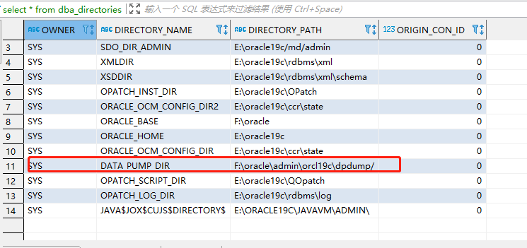

# oracle

## 命令

### 用户

```sql

- 解锁用户账号
ALTER USER 用户名 ACCOUNT UNLOCK;

- 删除用户
drop user {用户名} cascade;

- 修改用户密码
ALTER USER 用户名 IDENTIFIED BY 新密码;

```

### 数据文件

```sql

# 删除数据文件
alter database tempfile '{数据文件绝对路径}' drop;

# 删除表空间及数据文件
drop tablespace {表空间名} including contents and datafiles;

```

### 分页查询

```sql

-- 方式1
-- 40为pageCurrent * pageSize，30 应为为(pageCurrent - 1) * pageSize
SELECT * FROM  
(  
SELECT A.*, ROWNUM RN  
FROM (SELECT * FROM TABLE_NAME 
      WHERE 1 = 1 -- 条件
      ORDER BY CREATETIME DESC -- 排序
     ) A  
    WHERE ROWNUM <= 40  
 )  
WHERE RN > 30

-- 方式2
SELECT * FROM  
(  
SELECT A.*, ROWNUM RN  
FROM (SELECT * FROM TABLE_NAME) A  
)  
WHERE 30 < RN AND RN <= 40 

```

方法一比方法二效率要高很多，查询效率提高主要体现在 WHERE ROWNUM &lt;= 40 这个语句上。

### 系统信息查询

&gt; 字段注释查询

```sql

select * from user_col_comments a
where Table_Name='这里填表名'
order by column_name

```

## 导入导出

### 导出

```sql

expdp {数据库账号}/\"{数据库密码}\"@{数据库地址}/orclpdb DIRECTORY=DATA_PUMP_DIR dumpfile={备份文件名称}.dump logfile={备份日志名称}.log schemas={备份的模式};

```

### 导入 

&gt; 创建表空间

```sql

create tablespace ESB_MEDICAL datafile 'D:\app\oracle19c\oradata\orcl\esb_medical.dbf' size 512M autoextend on next 256M maxsize unlimited;

```

&gt; 创建临时表空间

```sql

create TEMPORARY tablespace ESB_MEDICAL_TEMP tempfile 'D:\app\oracle19c\oradata\orcl\esb_medical_temp.dbf' size 512M autoextend on next 256M maxsize unlimited;

```

&gt; 创建用户及用户和表关系

创建用户并绑定用户和表空间及临时表空间的关系

```sql

create user {用户名} identified by {密码} DEFAULT tablespace ESB_MEDICAL temporary tablespace ESB_MEDICAL_TEMP account unlock;

```

&gt; 授予用户权限

```sql

-- 赋予用户connect和resource权限
grant connect,resource to esb_medical;
-- 赋予用户创建视图的权限
grant create view to esb_medical;
-- 赋予用户创建同义词的权限
grant create synonym to esb_medical;
-- 用户授权表空间权限
alter user esb_medical QUOTA UNLIMITED ON ESB_MEDICAL;
alter user esb_medical QUOTA UNLIMITED ON "USERS";
-- 更改用户的表空间限额（无限制）
grant unlimited tablespace to esb_medical;
-- 给用户授权目录读写权限
grant read,write on directory DATA_PUMP_DIR to esb_medical;

```

&gt; 导入数据库

:::tip

如果管理员用户不能直接登录，需要通过 sys as SYSDBA 方式登录

:::

- 查询备份文件路径

```sql

select * from dba_directories;

```

- 找到DATA_PUMP_DIR的值，如下图：



- 拷贝备份文件到上面的文件夹下
- 还原备份文件

```sql

impdp {管理员账号}/\"{管理员密码}\"@{数据库地址}/{数据库} DIRECTORY=DATA_PUMP_DIR dumpfile={导入文件名}.DUMP logfile={导入日志名}.log  remap_schema={原数据库模式名}:{新数据库模式名} remap_tablespace={原数据库表空间名}:{新表空间名}

-- 导入示例
impdp 127.0.0.1/MSMR_TEST DIRECTORY=DATA_PUMP_DIR dumpfile=exp_fc_20240816.dmp logfile=exp_fc_20240816.log  remap_schema=FC:MSMR_TEST remap_tablespace=DATA:USERS
```

## 常见问题

:::tip
windows cmd启动jar包，用户名中文导致数据库连接不上
:::

```bash

启动时加上参数：-Duser.name=user

```
