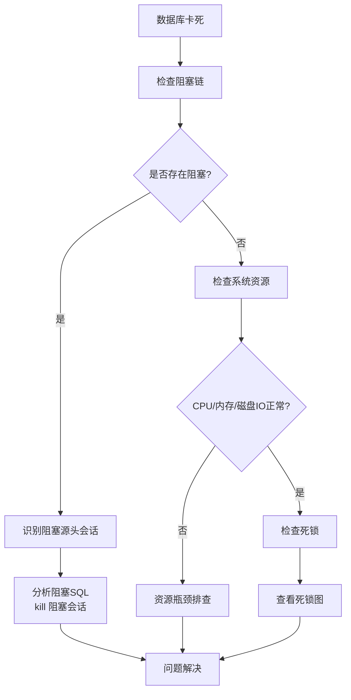
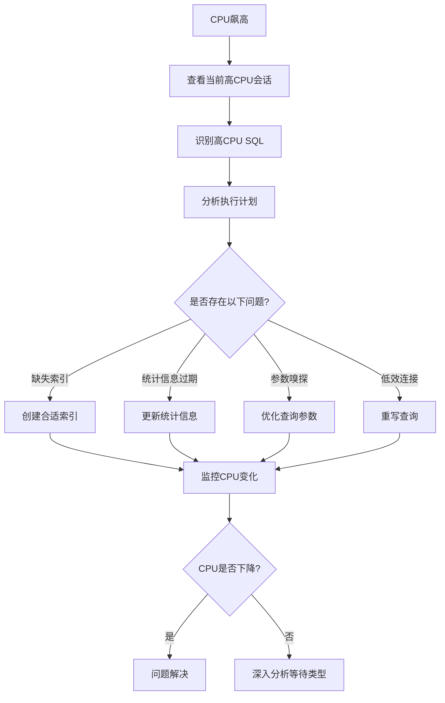
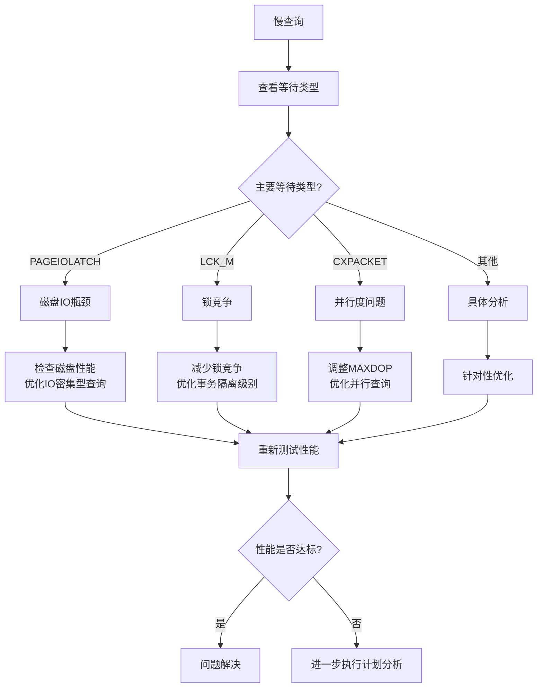

# SQL Server 当前执行SQL监控与排查指南

在 Microsoft SQL Server 生产环境中，实时监控正在执行的 SQL 语句是性能调优和故障排查的关键。本文提供从三个层面入手的完整监控方案：

* 🔹 **实时会话**（谁在跑）
* 🔹 **正在执行的语句文本**
* 🔹 **阻塞 / 等待情况**

## 一、查看当前正在执行的 SQL（推荐）

```sql
SELECT 
    r.session_id,
    s.login_name,
    s.host_name,
    s.program_name,
    r.status,
    r.command,
    r.cpu_time,
    r.total_elapsed_time,
    r.reads,
    r.writes,
    r.logical_reads,
    r.wait_type,
    r.wait_time,
    r.blocking_session_id,
    SUBSTRING(t.text, 
        (r.statement_start_offset/2)+1,
        ((CASE r.statement_end_offset
            WHEN -1 THEN DATALENGTH(t.text)
            ELSE r.statement_end_offset
        END - r.statement_start_offset)/2)+1) AS executing_sql
FROM sys.dm_exec_requests r
JOIN sys.dm_exec_sessions s ON r.session_id = s.session_id
CROSS APPLY sys.dm_exec_sql_text(r.sql_handle) t
WHERE r.session_id <> @@SPID
ORDER BY r.total_elapsed_time DESC;
```

### 重点字段说明

| 字段 | 说明 |
|------|------|
| `session_id` | 会话ID |
| `status` | `running` / `suspended` |
| `cpu_time` | 已用CPU时间（毫秒） |
| `total_elapsed_time` | 执行总时间（毫秒） |
| `wait_type` | 当前等待类型 |
| `blocking_session_id` | 阻塞该会话的会话ID |
| `executing_sql` | 当前正在执行的SQL片段 |

## 二、查看所有连接（包括空闲）

```sql
SELECT 
    session_id,
    login_name,
    host_name,
    program_name,
    status
FROM sys.dm_exec_sessions
WHERE is_user_process = 1;
```

## 三、查看阻塞情况

```sql
SELECT 
    blocking_session_id AS blocking_spid,
    session_id AS blocked_spid,
    wait_type,
    wait_time,
    wait_resource
FROM sys.dm_exec_requests
WHERE blocking_session_id <> 0;
```

## 四、查看最耗时的SQL（历史统计）

```sql
SELECT TOP 10
    total_worker_time/1000 AS total_cpu_ms,
    execution_count,
    total_elapsed_time/1000 AS total_elapsed_ms,
    (total_elapsed_time/execution_count)/1000 AS avg_elapsed_ms,
    SUBSTRING(t.text, 1, 4000) AS sql_text
FROM sys.dm_exec_query_stats qs
CROSS APPLY sys.dm_exec_sql_text(qs.sql_handle) t
ORDER BY total_worker_time DESC;
```

## 五、图形化监控方式

### SQL Server Management Studio (SSMS)

操作路径：
```
对象资源管理器
 → 服务器
 → 右键
 → 活动监视器 (Activity Monitor)
```

可以看到：
* **Processes**（当前进程）
* **Resource Waits**（资源等待）
* **Data File I/O**（数据文件IO）
* **Recent Expensive Queries**（最近昂贵查询）

## 六、极简版：只看"正在跑"的SQL

```sql
SELECT 
    r.session_id,
    r.status,
    r.cpu_time,
    t.text
FROM sys.dm_exec_requests r
CROSS APPLY sys.dm_exec_sql_text(r.sql_handle) t
WHERE r.status = 'running';
```

## 七、生产环境排查建议

性能问题分析时，建议按以下顺序排查：

1. **先看** `blocking_session_id` - 是否有阻塞链
2. **再看** `wait_type` - 等待类型（如PAGEIOLATCH、LCK_M等）
3. **接着看** `cpu_time` 和 `logical_reads` - 资源消耗
4. **最后抓取**执行计划分析

### 抓取执行计划

```sql
-- 获取plan_handle后使用
SELECT * 
FROM sys.dm_exec_query_plan(<plan_handle>);
```

## 八、生产环境标准排查流程图

根据不同的性能问题场景，采用不同的排查路径：

### 场景1：数据库卡死（无响应）



**排查步骤：**
1. 运行`sp_who2`或阻塞查询查看阻塞链
2. 找到阻塞源头会话（`blocking_session_id`）
3. 分析该会话正在执行的SQL
4. 考虑kill阻塞会话或优化相关SQL

### 场景2：CPU飙高



**排查步骤：**
1. 使用`sys.dm_exec_requests`按`cpu_time`排序
2. 找到消耗CPU最多的SQL
3. 查看执行计划，检查缺失索引警告
4. 检查统计信息最后更新时间
5. 考虑查询重写或添加索引

### 场景3：慢查询排查



**排查步骤：**
1. 识别慢查询的具体SQL
2. 查看`wait_type`确定瓶颈类型
3. 根据等待类型采取相应优化措施
4. 分析执行计划中的警告和成本分布

## 九、常用DMV（动态管理视图）参考

| DMV | 用途 |
|-----|------|
| `sys.dm_exec_requests` | 当前正在执行的请求 |
| `sys.dm_exec_sessions` | 当前所有会话 |
| `sys.dm_exec_sql_text` | 获取SQL文本 |
| `sys.dm_exec_query_stats` | 查询执行统计 |
| `sys.dm_exec_query_plan` | 获取执行计划 |
| `sys.dm_os_wait_stats` | 系统等待统计 |
| `sys.dm_io_virtual_file_stats` | 数据库文件IO统计 |

## 十、自动化监控脚本示例

```sql
-- 监控阻塞的自动化脚本
DECLARE @blocking TABLE (
    blocking_spid INT,
    blocked_spid INT,
    wait_type NVARCHAR(60),
    wait_time INT,
    wait_resource NVARCHAR(256),
    collection_time DATETIME DEFAULT GETDATE()
);

INSERT INTO @blocking
SELECT 
    blocking_session_id,
    session_id,
    wait_type,
    wait_time,
    wait_resource
FROM sys.dm_exec_requests
WHERE blocking_session_id <> 0;

-- 记录到监控表
INSERT INTO dbo.blocking_monitor
SELECT * FROM @blocking;
```

## 总结

SQL Server性能监控需要多维度结合：
1. **实时监控**：使用`sys.dm_exec_requests`查看当前执行
2. **历史分析**：使用`sys.dm_exec_query_stats`分析趋势
3. **阻塞排查**：关注`blocking_session_id`和`wait_type`
4. **资源分析**：结合CPU、内存、磁盘IO等系统指标
5. **执行计划**：最终优化需要分析查询执行计划

根据具体问题场景（卡死、CPU高、慢查询），采用对应的排查流程图，可以快速定位和解决生产环境性能问题。