# Git 安装指南

## 下载

打开git官网地址：https://git-scm.com/进行下载，如下图界面：

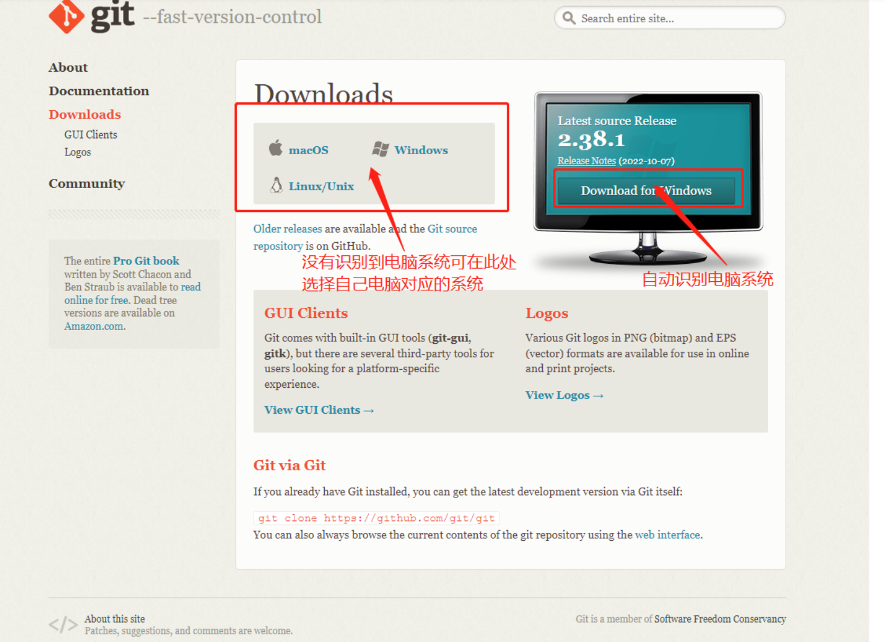

如图片中描述：一般进入官网后会识别电脑对应系统（识别出了我的电脑是Windows系统 。如果未识别到电脑系统，可在左侧选择自己电脑对应的系统），直接点击 " Download for Windows " 或者 " Windows " 进入git版本页面

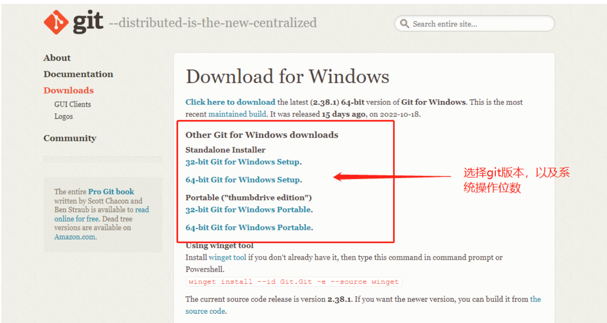

:::tip
注意：选择版本之前需要先确定自己电脑的操作位数选择对应操作位的安装包。（桌面上鼠标右键 “计算机” 或者 “此电脑” 点击 “属性” 查看操作位数）
:::

根据操作系统和操作位数选择对应的安装包点击，等待下载完成即可（一般选择 “Standalone Installer” 基本版本就行了）

## 安装

1. 找到下载好的安装程序，双击运行安装程序

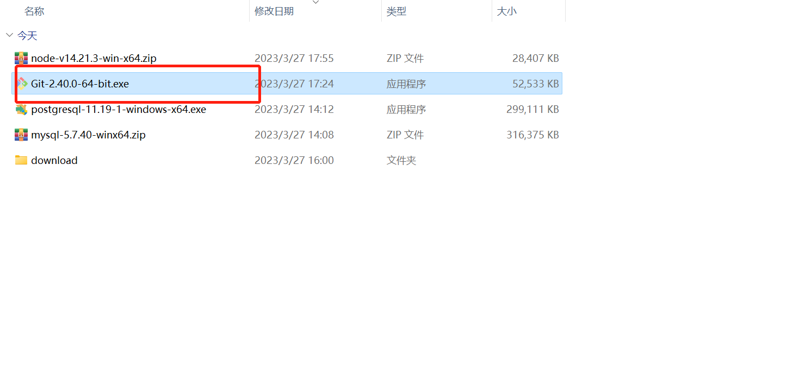

2. 许可声明： 点击 Next即可

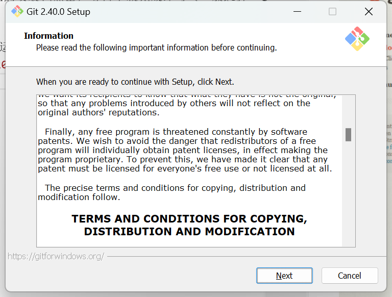

3. 设置安装路径

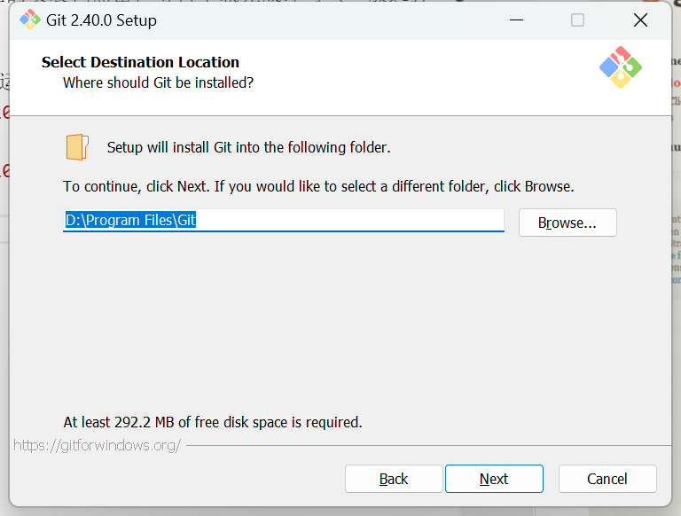

4. 选择git组件默认即可

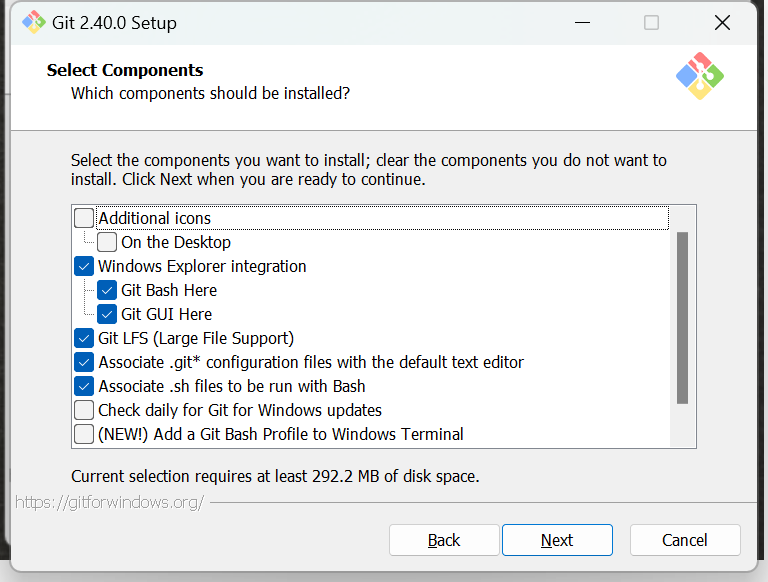

5. 创建菜单名称默认即可

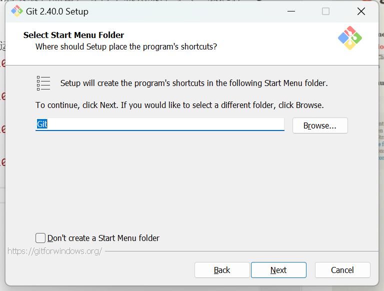

6. 文件默认编辑器：默认为 Vim, 可在下拉框中修改，可修改为submit，VSCode等，建议不要动，直接点击Next进入下一步

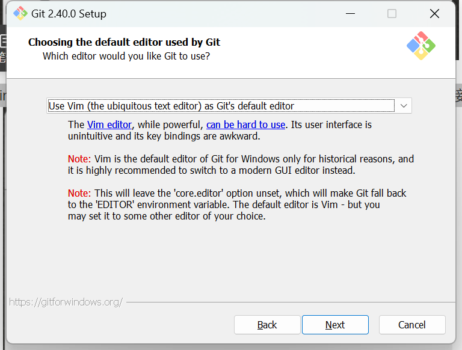

7. 设置新存储库中初始分支的名称： 默认初始分支的名称是“master”，如果要修改可选择第二个，在文本框中输入内容即可，建议不要动，直接点击Next进入下一步

8. 调整Path环境： 建议不要动，使用默认配置，直接点击Next进入下一步

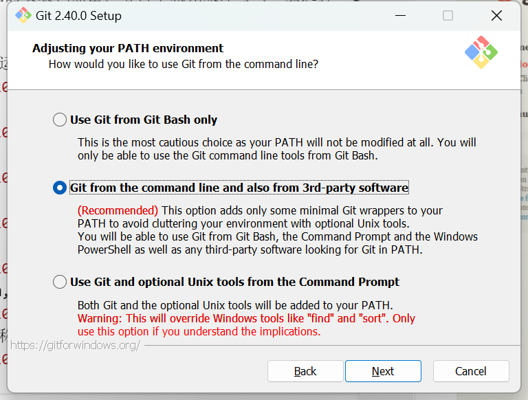

9. 选择SSH可执行文件： 建议不要动，使用默认配置，直接点击Next进入下一步

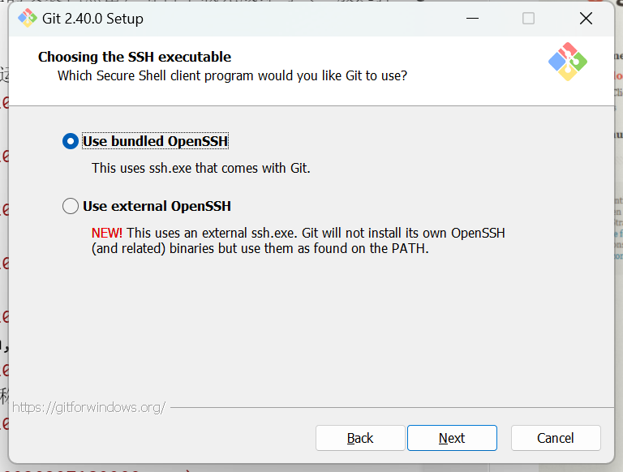

10. 选择HTTPS后端传输： 建议不要动，使用默认配置，直接点击Next进入下一步

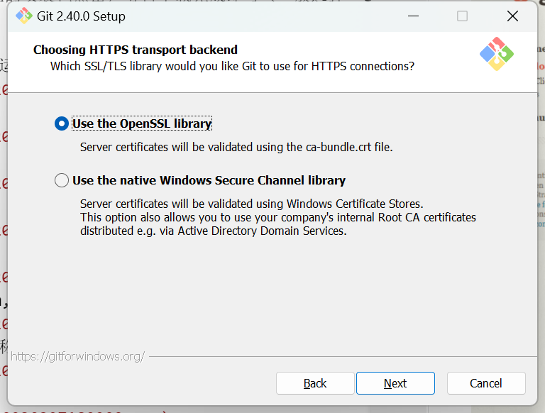

11. 配置行尾符号转换： 建议不要动，使用默认配置，直接点击Next进入下一步

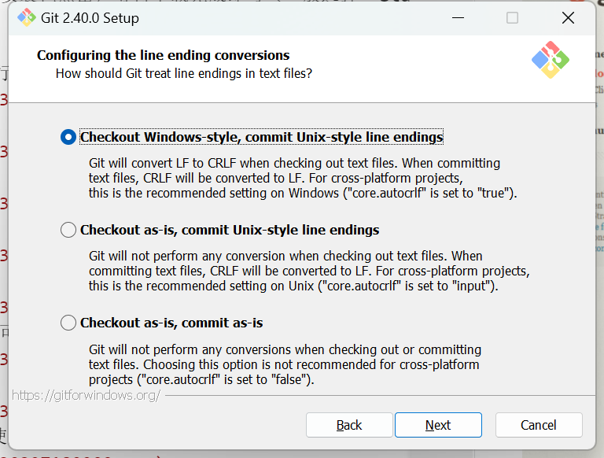

12. 配置用于Git Bash的终端模拟器： 建议不要动，使用默认配置，直接点击Next进入下一步

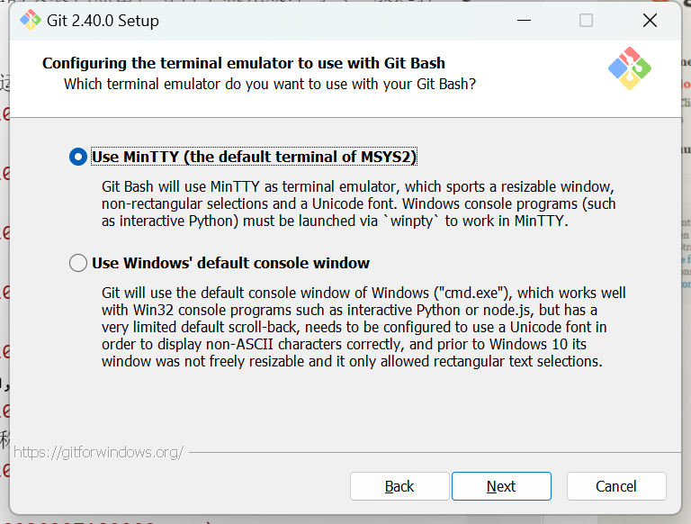

13. 选择git pull的默认行为： 建议不要动，使用默认配置，直接点击Next进入下一步

14. 配置凭证管理器： 建议不要动，使用默认配置，直接点击Next进入下一步

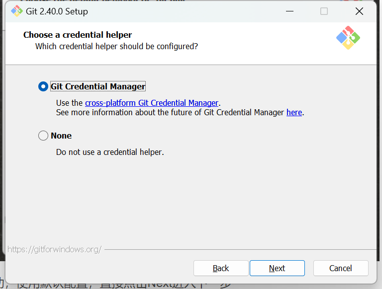

15. 配置额外选项： 建议不要动，使用默认配置，直接点击Next进入下一步

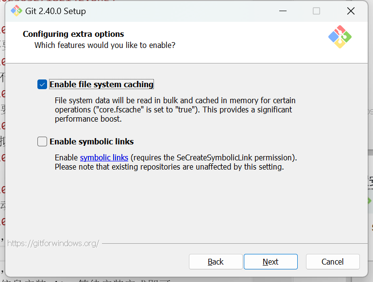

16. 配置实验选项： 建议不要动，使用默认配置，直接点击Install进行安装

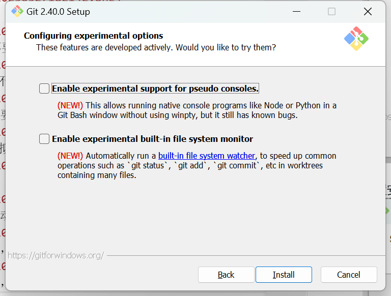

17. 开始安装： 根据前面的配置信息安装git，等待安装完成即可

18. 安装完成： 点击Finish完成安装

19. 验证

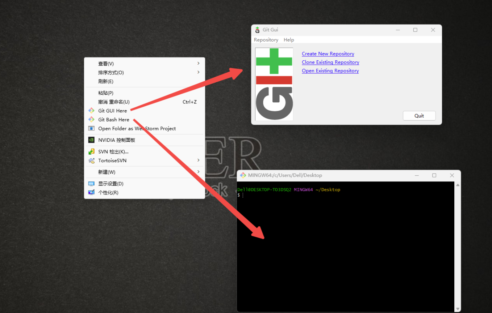