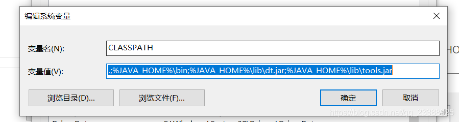
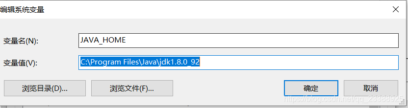
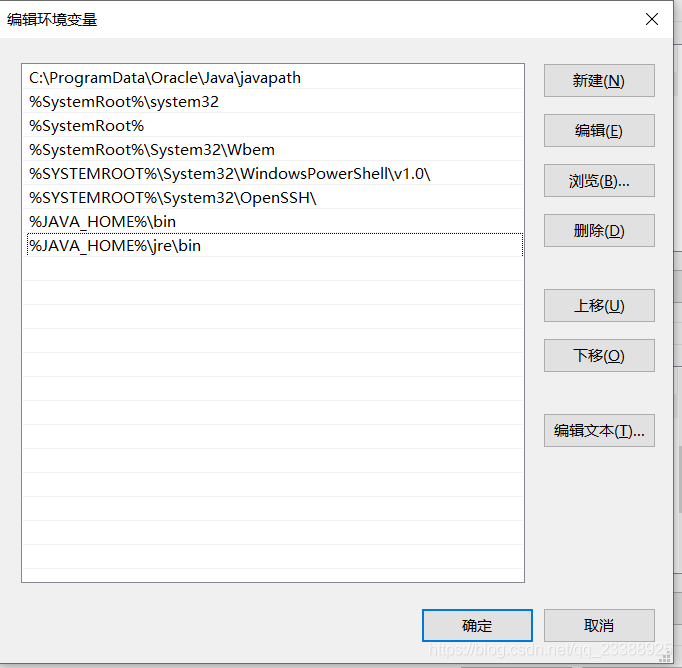

# 环境搭建

在不同系统环境搭建说明

## windows环境配置

> 创建CLASSPATH环境变量，如下

`.;%JAVA_HOME%\bin;%JAVA_HOME%\lib\dt.jar;%JAVA_HOME%\lib\tools.jar`


 
> 创建JAVA_HOME环境变量，变量值：

```text
jdk安装路径，示例：C:\Program Files\Java\jdk1.8.0_92 (以实际安装为准)
```



> 在path环境变量中加入变量

```text
%JAVA_HOME%\bin;%JAVA_HOME%\jre\bin
```



多版本JDK使用新建多个JAVA_HOME环境变量选着不同的jdk版本，通过JAVA_HOME+数字方式区分版本，激活那个版本则那个版本使用JAVA_HOME环境变量名

## linux环境搭建

:::tip

使用source 执行脚本或者执行脚本之后再执行一次 source /etc/profile使配置生效

:::

```bash
#!/bin/bash
# shell script tp unzip tomcat(version:apache-tomcat-8.0.32.tar.gz)
# shell script tp install jdk(version:jdk1.8.0_91)
# version 1.0
# created by fangcongyang@yunshiyou.com 
# Sat Oct 15 11:46:08 CST 2016
# Step1.Check jdk exists or not !
#wget --no-cookies --no-check-certificate --header "Cookie: gpw_e24=http%3A%2F%2Fwww.oracle.com%2F; oraclelicense=accept-securebackup-cookie" "http://download.oracle.com/otn-pub/java/jdk/8u141-b15/336fa29ff2bb4ef291e347e091f7f4a7/jdk-8u141-linux-x64.tar.gz"

if [ -n "$(rpm -qa | grep jdk)" ];
	then
	for i in $(rpm -qa | grep jdk)
	do
		echo "-->[`date +"%Y-%m-%d %H:%M.%S"`] Deleting "$i
		sudo yum -y remove $i
	done
	else
		echo "-->[`date +"%Y-%m-%d %H:%M.%S"`] Deleting is not defind"
fi

# Step2.Feedback if jdk was uninstalled or not !

if [ -n "$(rpm -qa | grep jdk)" ];
	then
	echo "-->[`date +"%Y-%m-%d %H:%M.%S"`] Failed to delete the " $i
	exit 1
fi

# Step3.unzip jdk
if [ -e /home/software/jdk-8u141-linux-x64.tar.gz ];
	then
	cd /home/software/
	tar -zxf jdk-8u141-linux-x64.tar.gz -C /home
	cd ..
	mv jdk1.8.0_141 jdk18
	if [ $? -eq 0 ];
	then
		echo "-->[`date +"%Y-%m-%d %H:%M.%S"`] Successfully unzip jdk-8u141-linux-x64.tar.gz"
	fi
else 
	echo "-->[`date +"%Y-%m-%d %H:%M:%S"`] the /home/website/jdk-8u141-linux-x64.tar.gz is not defind!!!"
	exit 1
fi

# Step4.Config jdk-envrionment 

cp /etc/profile /etc/profile.beforeInstallJDKenv.bak

echo "# For jdk8 start" >> /etc/profile
echo "JAVA_HOME=/home/jdk18" >> /etc/profile
echo "PATH=\$JAVA_HOME/bin:\$PATH" >> /etc/profile
echo "CLASSPATH=.:\$JAVA_HOME/lib/dt.jar:\$JAVA_HOME/lib/tools.jar" >> /etc/profile

echo "export JAVA_HOME" >> /etc/profile
echo "export PATH" >> /etc/profile
echo "export CLASSPATH" >> /etc/profile
echo "# For jdk8 end " >> /etc/profile

source /etc/profile
echo "-->[`date +"%Y-%m-%d %H:%M.%S"`] JDK environment has been successed set in /etc/profile."
echo "-->[`date +"%Y-%m-%d %H:%M.%S"`] java -version"
java -version

source /etc/profile

# Step5.Do a test
javac
```

## 项目启动

### 启动参数示例

参数说明：

- -server：指定使用服务器模式启动JVM，该模式下JVM会启用一些服务器端的优化，如垃圾回收器、线程管理等。
- -Xms2g：指定JVM初始堆内存大小为2GB。
- -Xmx2g：指定JVM最大堆内存大小为2GB。
- -jar：指定要运行的JAR文件。
- > nohup.out &：将JVM的输出重定向到nohup.out文件，并在后台运行。

```bash
## 普通项目启动
nohup java -server -Xms2g -Xmx2g -jar arsenal-admin-1.0.0-20231024.014433-237.jar > nohup.out &
## 加密项目启动
nohup java -server -Xms8g -Xmx8g -DmonitorSecretKey=monitor -javaagent:xxx.jar="-pwd yh\$3641" -jar xxx.jar --server.port=8915 > xxx.out
```

### 启动脚本示例

+ 启动不设置参数

```bash
#!/bin/bash
APP_HOME=`pwd`

FILES=`ls`

APP_NAME = ""

for file in $FILES
do
	if [ ${file:0:24} = "fusion-engine-boot-mapdb" ]; then
		echo $file
		if [ ${file##*.} = "jar" ]; then
			APP_NAME=$file
		fi
	fi
done

tpid=`ps -ef|grep $APP_NAME|grep -v grep|grep -v kill|awk '{print $2}'`
if [ ${tpid} ]; then
echo 'Stop Process...'
kill -9 $tpid
fi

# 再次查看进程是否已结束
tpid=`ps -ef|grep $APP_NAME|grep -v grep|grep -v kill|awk '{print $2}'`
if [ ${tpid} ]; then
echo 'Stop Process...'
kill -9 $tpid
else
echo 'Stop Procecss Successfully!'
echo 'start Procecss...'
# 启动程序，简单的启动
nohup java -server -Xms8g -Xmx8g -DmonitorSecretKey=monitor -javaagent:$APP_HOME/$APP_NAME="-pwd yh\$3641" -jar $APP_HOME/$APP_NAME --server.port=8915 > fusion-engine.out & echo "fusion engine is starting"

# 动态查看日志文件
tail -300f fusion-engine.out
fi
```

+ 启动设置参数

```bash
# 启动脚本
#!/bin/bash
APP_HOME=`pwd`

FILES=`ls`

APP_NAME = ""

for file in $FILES
do
	if [ ${file:0:15} = "yhdcs-framework" ]; then
		echo $file
		if [ ${file##*.} = "jar" ]; then
			APP_NAME=$file
		fi
	fi
done

tpid=`ps -ef|grep $APP_NAME|grep -v grep|grep -v kill|awk '{print $2}'`
if [ ${tpid} ]; then
echo 'Stop Process...'
kill -9 $tpid
fi

# 再次查看进程是否已结束
tpid=`ps -ef|grep $APP_NAME|grep -v grep|grep -v kill|awk '{print $2}'`
if [ ${tpid} ]; then
echo 'Stop Process...'
kill -9 $tpid
else
echo 'Stop Procecss Successfully!'
echo 'start Procecss...'
# 启动程序，简单的启动
nohup java -server -Xmx4096m -Xms2048m \
 -XX:MetaspaceSize=128M -XX:MaxMetaspaceSize=256M \
 -Dserver.port=8091 \
 -jar "$APP_HOME/$APP_NAME" \
 --JDBC.pageDialect=postgresql \
 --JDBC.url="jdbc:postgresql://172.31.255.227:5588/mtt_ylfwzb_dev?currentSchema=yhdcs_ta404&useUnicode=true&characterEncoding=utf-8&characterSetResults=utf8" \
 --JDBC.username=mtt_ylfwzb_dev \
 --JDBC.password='mtt&ylfwzb@dev' \
 --JDBC.driverClassName=org.postgresql.Driver \
 --JDBC.validationQuery="select 1" \
 --WEBSECURITY.default-src="'unsafe-inline' 'unsafe-eval' 'self' data: ws://ta404/webSocketServer http://127.0.0.1:* http://172.20.20.169:8091 http://172.20.20.169:8092" \
 > yhdcs.out 2>&1 &

# 动态查看日志文件
tail -300f yhdcs.out
fi
```
