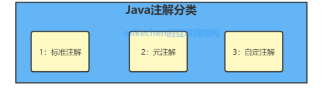

# 注解

Java注解又称Java标注，是在 JDK5 时引入的新特性，注解（也被称为元数据）。

Java注解它提供了一种安全的类似注释的机制，用来将任何的信息或元数据（metadata）与程序元素（类、方法、成员变量等）进行关联。

Java注解是附加在代码中的一些元信息，用于一些工具在编译、运行时进行解析和使用，起到说明、配置的功能。

## 应用

- 生成文档这是最常见的，也是java 最早提供的注解；
- 在编译时进行格式检查，如@Override放在方法前，如果你这个方法并不是覆盖了超类方法，则编译时就能检查出；
- 跟踪代码依赖性，实现替代配置文件功能，比较常见的是spring 2.5 开始的基于注解配置,作用就是减少配置；
- 在反射的 Class, Method, Field 等函数中，有许多于 Annotation 相关的接口,可以在反射中解析并使用 Annotation。

## 分类



### Java自带的标准注解
包括@Override、@Deprecated、@SuppressWarnings等，使用这些注解后编译器就会进行检查。

### 元注解
元注解是用于定义注解的注解，包括@Retention、@Target、@Inherited、@Documented、@Repeatable 等。

元注解也是Java自带的标准注解，只不过用于修饰注解，比较特殊。

### 自定义注解
用户可以根据自己的需求定义注解。

## java标准注解

JDK 中内置了以下注解：
| 注解名称 | 功能描述 |
| -- | -- |
| @Override | 检查该方法是否是重写方法，如果发现其父类或者是引用的接口中并没有该方法时，会报编译错误 |
| @Deprecated | 标记过时方法，如果使用该方法，会报编译警告 |
| @SuppressWarnings | 指示编译器去忽略注解中申明的警告 |
| @FunctionalInterface | java8支持，标识一个匿名函数和函数式接口 |

### @Override
如果试图使用 @Override 标记一个实际上并没有覆写父类的方法时，java 编译器会告警。

```java
class Parent {
  public void test() {
  }
}


class Child extends Parent  {
    /**
     *  放开下面的注释，编译时会告警
     */
    /* 
    @Override
    public void test() {
    }
    */
}
```

### @Deprecated
@Deprecated 用于标明被修饰的类或类成员、类方法已经废弃、过时，不建议使用。

```java
@Deprecated
class TestClass {
  // do something
}
```

### @SuppressWarnings
@SuppressWarnings 用于关闭对类、方法、成员编译时产生的特定警告。

> 参数说明

| 参数 | 作用 |
| -- | -- |
| deprecation | 使用了不赞成使用的类和方法时的警告 |
| unchecked | 执行了未检查的转换时的警告，例如当使用集合时没有用泛型（Generics）来指定集合保存的类型 |
| fallthrough | 当switch程序块直接通过下一种情况而没有break时的警告 |
| path | 在类路径、源文件路径等中有不存在的路径时的警告 |
| serial | 当在可序列化的类上缺少serialVersionUID定义时的警告 |
| finally | 任何finally子句不能正常完成时的警告 |
| all | 所有的警告 |

> 使用示例

1. 抑制单类型的警告

```java
@SuppressWarnings("unchecked")  
public void addItems(String item){  
  @SuppressWarnings("rawtypes")  
   List items = new ArrayList();  
   items.add(item);  
}
```
2. 抑制多类型的警告
```java
@SuppressWarnings(value={"unchecked", "rawtypes"})  
public void addItems(String item){  
  @SuppressWarnings("rawtypes")  
   List items = new ArrayList();  
   items.add(item);  
}
```
3. 抑制所有类型的警告
```java
@SuppressWarnings("all")  
public void addItems(String item){  
   List items = new ArrayList();  
   items.add(item); 
}
```

### @FunctionalInterface
@FunctionalInterface 用于指示被修饰的接口是函数式接口,在 JDK8 引入。

```java
@FunctionalInterface
public interface UserService {

    void getUser(Long userId);

    // 默认方法，可以用多个默认方法
    public default void setUser() {
    }

    // 静态方法
    public static void saveUser() {
    }
    
    // 覆盖Object中的equals方法
    public boolean equals(Object obj);
}
```
函数式接口(Functional Interface)就是一个有且仅有一个抽象方法，但是可以有多个非抽象方法的接口。

## Java元注解

元注解是java API提供的，是用于修饰注解的注解，通常用在注解的定义上：

###  @Retention

@Retention用来定义该注解在哪一个级别可用，在源代码中(SOURCE)、类文件中(CLASS)或者运行时(RUNTIME)。
@Retention 源码：

```java
@Documented
@Retention(RetentionPolicy.RUNTIME)
@Target(ElementType.ANNOTATION_TYPE)
public @interface Retention {
  RetentionPolicy value();
}
public enum RetentionPolicy {
  //此注解类型的信息只会记录在源文件中，编译时将被编译器丢弃，也就是说
  //不会保存在编译好的类信息中
  SOURCE,
  //编译器将注解记录在类文件中，但不会加载到JVM中。如果一个注解声明没指定范围，则系统
  //默认值就是Class
  CLASS,
  //注解信息会保留在源文件、类文件中，在执行的时也加载到Java的JVM中，因此可以反射性的读取。
  RUNTIME
}
```

RetentionPolicy 是一个枚举类型，它定义了被 @Retention 修饰的注解所支持的保留级别：

| 生命周期类型 | 描述 |
| -- | -- |
| RetentionPolicy.SOURCE | 编译时被丢弃，不包含在类文件中 |
| RetentionPolicy.CLASS | JVM加载时被丢弃，包含在类文件中，默认值 |
| RetentionPolicy.RUNTIME | 由JVM加载，包含在类文件中，在运行时可以被获取到 |

示例：

```java
@Target(ElementType.METHOD)
@Retention(RetentionPolicy.SOURCE) //注解信息只能在源文件中出现
public @interface Override {
}

@Documented
@Retention(RetentionPolicy.RUNTIME)  //注解信息在执行时出现
@Target(value={CONSTRUCTOR, FIELD, LOCAL_VARIABLE, METHOD, PACKAGE, PARAMETER, TYPE})
public @interface Deprecated {
}

@Target({TYPE, FIELD, METHOD, PARAMETER, CONSTRUCTOR, LOCAL_VARIABLE})
@Retention(RetentionPolicy.SOURCE)  //注解信息在源文件中出现
public @interface SuppressWarnings {
  String[] value();
}
```

### @Documented

@Documented：生成文档信息的时候保留注解，对类作辅助说明

示例：

```java
@Target(ElementType.FIELD)
@Retention(RetentionPolicy.RUNTIME)
@Documented
public @interface Column {
    public String name() default "fieldName";
    public String setFuncName() default "setField";
    public String getFuncName() default "getField";
    public boolean defaultDBValue() default false;
}
```

### @Target

@Target：用于描述注解的使用范围（即：被描述的注解可以用在什么地方）
@Target源码：

```java
@Documented
@Retention(RetentionPolicy.RUNTIME)
@Target(ElementType.ANNOTATION_TYPE)
public @interface Target {
    ElementType[] value();
}
```

ElementType 是一个枚举类型，它定义了被 @Target 修饰的注解可以应用的范围：

| Target类型 | 作用 |
| -- | -- |
| ElementType.TYPE | 应用于类、接口（包括注解类型）、枚举 |
| ElementType.FIELD | 应用于字段或属性 |
| ElementType.METHOD | 应用于方法 |
| ElementType.PARAMETER | 应用于方法的参数 |
| ElementType.CONSTRUCTOR | 应用于构造函数 |
| ElementType.LOCAL_VARIABLE | 应用于局部变量 |
| ElementType.ANNOTATION_TYPE | 应用于类、接口（包括注解类型）、枚举 |
| ElementType.PACKAGE | 应用于包 |
| ElementType.TYPE_PARAMETER | 1.8版本新增，应用于类型变量 |
| ElementType.TYPE_USE | 1.8版本新增，应用于任何使用类型的语句中 |

### @Inherited

@Inherited：说明子类可以继承父类中的该注解

表示自动继承注解类型。 如果注解类型声明中存在 @Inherited 元注解，则注解所修饰类的所有子类都将会继承此注解。

示例：

```java
@Inherited
public @interface Greeting {
    public enum FontColor{ BULE,RED,GREEN};
    String name();
    FontColor fontColor() default FontColor.GREEN;
}
```

### @Repeatable

@Repeatable 表示注解可以重复使用。

当我们需要重复使用某个注解时，希望利用相同的注解来表现所有的形式时，我们可以借助@Repeatable注解。

以 Spring @Scheduled 为例：

```java
@Target({ElementType.METHOD, ElementType.ANNOTATION_TYPE})
@Retention(RetentionPolicy.RUNTIME)
@Documented
public @interface Schedules {
    Scheduled[] value();
}


@Target({ElementType.METHOD, ElementType.ANNOTATION_TYPE})
@Retention(RetentionPolicy.RUNTIME)
@Documented
@Repeatable(Schedules.class)
public @interface Scheduled {
  // ...
}
```

## 自定义注解
### 自定义注解示例
1. 自定义日志注解
```java
package com.cp.oa.common.log;

import java.lang.annotation.*;

/**
 * 日志记录的信息
 *
 * @author fcy
 * @Date 2020-01-25 20:36:41
 */
@Target({ ElementType.METHOD, ElementType.TYPE })
@Retention(RetentionPolicy.RUNTIME)
@Documented
public @interface MethodLog {

    String value() default "";
}
```

2. 自定义重复提交注解
```java
package com.yinhai.common.resubmit;

import java.lang.annotation.*;

/**
 * 日志记录的信息
 *
 * @author fcy
 * @Date 2020-01-25 20:36:41
 */
@Target({ ElementType.METHOD, ElementType.TYPE })
@Retention(RetentionPolicy.RUNTIME)
@Documented
public @interface Resubmit {
    //重复提交名称
    String value() default "";
    //字段名称
    String[] fields() default {};
}
```

### 使用自定义注解

1. 所需依赖

```xml
<dependency>
    <groupId>org.aspectj</groupId>
    <artifactId>aspectjweaver</artifactId>
    <version>1.9.6</version>
    <scope>compile</scope>
</dependency>
```

2. 示例

```java
package com.yinhai.common.resubmit;

import com.yinhai.common.constant.IConsts;
import com.yinhai.common.util.WebUtils;
import com.yinhai.ta404.core.exception.AppException;
import org.aspectj.lang.ProceedingJoinPoint;
import org.aspectj.lang.annotation.Around;
import org.aspectj.lang.annotation.Aspect;
import org.springframework.beans.factory.annotation.Autowired;
import org.springframework.stereotype.Component;

import javax.servlet.http.HttpServletRequest;
import java.util.Map;
import java.util.StringJoiner;
import java.util.concurrent.ConcurrentHashMap;
import java.util.concurrent.locks.ReentrantLock;

/**
 * 重复提交切面类
 *
 * @author fcy
 * @date 2017-05-08 20:21
 */
@Aspect
@Component
public class ResubmitAspect {
    private final HttpServletRequest request;
    //防止重复提交map
    private static final ConcurrentHashMap<String, ReentrantLock> RESUBMIT_LOCK = new ConcurrentHashMap<>();

    @Autowired
    public ResubmitAspect(HttpServletRequest request) {
        this.request = request;
    }

    /**
     * 执行完方法后插入日志
     */
    @Around(value="execution(* com.yinhai.*.rest.*.*(..)) && @annotation(resubmit)")
    public Object around(ProceedingJoinPoint pjp, Resubmit resubmit) throws Throwable {
        Map<String, String> openParamMap = WebUtils.getParams(request);
        StringJoiner resubmitKey = new StringJoiner(IConsts.JOINER_);
        for (String field : resubmit.fields()) {
            resubmitKey.add(openParamMap.get(field));
        }
        ReentrantLock lock = RESUBMIT_LOCK.computeIfAbsent(resubmitKey.toString(), key -> new ReentrantLock());
        if (lock.isLocked()) {
            throw new AppException(resubmit.value() + "重复提交!");
        }
        lock.lock();
        try {
            return pjp.proceed();
        } catch (Exception e) {
            throw new AppException(e.getMessage());
        } finally {
            lock.unlock();
        }
    }
}

```

依赖的工具类：

```java
package com.yinhai.common.util;

import org.apache.commons.lang3.StringUtils;
import org.slf4j.Logger;
import org.slf4j.LoggerFactory;

import javax.servlet.http.Cookie;
import javax.servlet.http.HttpServletRequest;
import javax.servlet.http.HttpServletResponse;
import java.io.IOException;
import java.io.PrintWriter;
import java.util.HashMap;
import java.util.Map;
import java.util.regex.Matcher;
import java.util.regex.Pattern;

/**
 * @Description ：web工具类
 * @Author ： fcy
 * @Date ： 2017/09/19 09:59
 */
public class WebUtils {
    protected static Logger logger = LoggerFactory.getLogger(WebUtils.class);

    /**
     * 获取上下文URL全路径
     * @param request
     * @return
     */
    public static String getContextPath(HttpServletRequest request) {
        StringBuilder sb = new StringBuilder();
        sb.append(request.getScheme()).append("://");
        sb.append(request.getServerName());
        //80端口无需拼接
        int serverDefaultPort = 80;
        if(request.getServerPort() != serverDefaultPort){
            sb.append(":").append(request.getServerPort());
        }
        sb.append(request.getContextPath());
        return sb.toString();
    }

    /**
     * 获取上次访问的URL链接
     * @param request
     * @return
     */
    public static String getLastUrl(HttpServletRequest request) {
        String path = getContextPath(request);
        String referer = request.getHeader("referer");
        if(StringUtils.isNotEmpty(referer)){
            int index = path.length();
            return referer.substring(index);
        }else{
            return null;
        }
    }


    /**
     * 获取客户端真实ip
     * @param request
     * @return
     */
    public static String getClientIp(HttpServletRequest request) {
        String ip = request.getHeader("x-forwarded-for");
        String unKnown = "unknown";
        if (StringUtils.isEmpty(ip) || ip.length() == 0 || unKnown.equalsIgnoreCase(ip)) {
            ip = request.getHeader("Proxy-Client-IP");
        }
        if (StringUtils.isEmpty(ip) || ip.length() == 0 || unKnown.equalsIgnoreCase(ip)) {
            ip = request.getHeader("WL-Proxy-Client-IP");
        }
        if (StringUtils.isEmpty(ip) || ip.length() == 0 || unKnown.equalsIgnoreCase(ip)) {
            ip = request.getRemoteAddr();
        }
        return "0:0:0:0:0:0:0:1".equals(ip) ? "127.0.0.1" : ip;
    }

    /**
     * 获取指定url中的某个参数
     * @param url
     * @param name
     * @return
     */
    public static String getParamByUrl(String url, String name) {
        url += "&";
        String pattern = "([?&])#?" + name + "=[a-zA-Z0-9]*(&)";

        Pattern r = Pattern.compile(pattern);

        Matcher m = r.matcher(url);
        if (m.find( )) {
            System.out.println(m.group(0));
            return m.group(0).split("=")[1].replace("&", "");
        } else {
            return null;
        }
    }

    /**
     * 获取request请求里的参数
     * @param request
     * @return
     */
    public static Map<String,String> getParams(HttpServletRequest request){
        Map<String,String> params = new HashMap<>(10);
        Map requestParams = request.getParameterMap();
        for (Object o : requestParams.keySet()) {
            String name = (String) o;
            String[] values = (String[]) requestParams.get(name);
            String valueStr = "";
            for (int i = 0; i < values.length; i++) {
                valueStr = (i == values.length - 1) ? valueStr + values[i]
                        : valueStr + values[i] + ",";
            }
            params.put(name, valueStr);
        }
        return params;
    }

    /**
     * 设置cookie
     * @param response
     * @param name
     * @param value
     * @param maxAge
     */
    public static void setCookie(HttpServletResponse response, String name, String value, int maxAge) {
        Cookie cookie = new Cookie(name, value);
        cookie.setPath("/");
        if (maxAge > 0) {
            cookie.setMaxAge(maxAge);
        }
        response.addCookie(cookie);
    }

    /**
     * 根据名字获取cookie
     * @param request
     * @param name
     * @return
     */
    public static Cookie getCookieByName(HttpServletRequest request, String name) {
        Map<String, Cookie> cookieMap = readCookieMap(request);
        if (cookieMap.containsKey(name)) {
            Cookie cookie = cookieMap.get(name);
            return cookie;
        } else {
            return null;
        }
    }

    /**
     * 将cookie封装到Map里面
     * @param request
     * @return
     */
    private static Map<String, Cookie> readCookieMap(HttpServletRequest request) {
        Map<String, Cookie> cookieMap = new HashMap<String, Cookie>();
        Cookie[] cookies = request.getCookies();
        if (null != cookies) {
            for (Cookie cookie : cookies) {
                cookieMap.put(cookie.getName(), cookie);
            }
        }
        return cookieMap;
    }

    /**
     * 输出JSON内容
     * @param response
     * @param json
     * @return
     */
    public static void printJson(HttpServletResponse response, String json) {
        PrintWriter pw = null;
        try {
            response.setContentType("application/json; charset=UTF-8");
            pw = response.getWriter();
            pw.print(json);
            pw.flush();
        } catch (IOException e) {
            logger.error("输出json失败！", e);
        } finally {
            if (pw != null) {
                pw.close();
            }
        }
    }
}
```