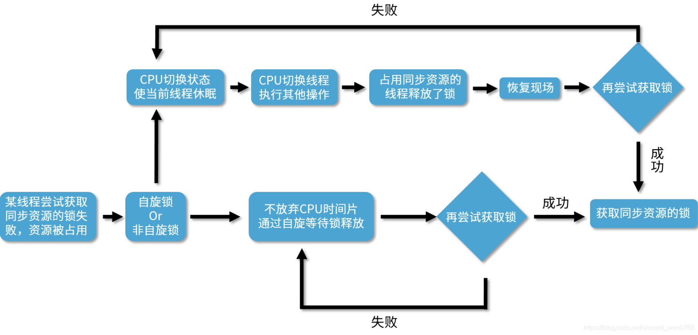

# 并发锁

## 公平锁和非公平锁

- **公平锁**：是指多个线程按照申请锁的顺序来获取锁，类似排队打饭，先来后到。
- **非公平锁**：是指多个线程获取锁的顺序并不是按照申请锁的顺序，有可能后申请的线程比先申请的线程优先获取锁。（在高并发的情况下，有可能会造成优先级反转或者饥饿现象）

&gt; 区别

- 公平锁，就是很公平，在并发环境中，每个线程在获取锁时会先查看此锁维护的等待队列，如果为空，或者当前线程是等待队列的第一个，就占有锁，否则就会加入到等待队列中，以后会按照FIFO的规则从队列中取到自己。
- 非公平锁比较粗鲁，上来就直接尝试占有锁，如果尝试失败，就再采用类似公平锁那种方式。
- 非公平锁的优点在于吞吐量比公平锁大。
- 对于Synchronized而言，也是一种非公平锁。

## 自旋锁

"自旋"可以理解为"自我旋转"，这里的"旋转"指"循环"，比如 while 循环或者 for 循环。"自旋"就是自己在这里不停地循环，直到目标达成。而不像普通的锁那样，如果获取不到锁就进入阻塞。

### 自旋和非自旋的获取锁的流程



自旋锁，它并不会放弃 CPU 时间片，而是通过自旋等待锁的释放，也就是说，它会不停地再次地尝试获取锁，如果失败就再次尝试，直到成功为止。

非自旋锁，非自旋锁和自旋锁是完全不一样的，如果它发现此时获取不到锁，它就把自己的线程切换状态，让线程休眠，然后 CPU 就可以在这段时间去做很多其他的事情，直到之前持有这把锁的线程释放了锁，于是 CPU 再把之前的线程恢复回来，让这个线程再去尝试获取这把锁。如果再次失败，就再次让线程休眠，如果成功，一样可以成功获取到同步资源的锁。

:::note

非自旋锁和自旋锁最大的区别，就是如果它遇到拿不到锁的情况，它会把线程阻塞，直到被唤醒。而自旋锁会不停地尝试。

:::

### 优缺点

- **优点**

阻塞和唤醒线程都是需要高昂的开销的，如果同步代码块中的内容不复杂，那么可能转换线程带来的开销比实际业务代码执行的开销还要大。

在很多场景下，可能我们的同步代码块的内容并不多，所以需要的执行时间也很短，如果我们仅仅为了这点时间就去切换线程状态，那么其实不如让线程不切换状态，而是让它自旋地尝试获取锁，等待其他线程释放锁，有时我只需要稍等一下，就可以避免上下文切换等开销，提高了效率。

:::note

自旋锁的好处，那就是自旋锁用循环去不停地尝试获取锁，让线程始终处于 Runnable 状态，节省了线程状态切换带来的开销。

:::

- **缺点**

它最大的缺点就在于虽然避免了线程切换的开销，但是它在避免线程切换开销的同时也带来了新的开销，因为它需要不停得去尝试获取锁。如果这把锁一直不能被释放，那么这种尝试只是无用的尝试，会白白浪费处理器资源。也就是说，虽然一开始自旋锁的开销低于线程切换，但是随着时间的增加，这种开销也是水涨船高，后期甚至会超过线程切换的开销，得不偿失。

### 适用场景

:::tip

自旋锁适用于并发度不是特别高的场景，以及临界区比较短小的情况，这样我们可以利用避免线程切换来提高效率。

可是如果临界区很大，线程一旦拿到锁，很久才会释放的话，那就不合适用自旋锁，因为自旋会一直占用 CPU 却无法拿到锁，白白消耗资源。

:::

### Java自旋锁使用

在 Java 1.5 版本及以上的并发包中，也就是 java.util.concurrent 的包中，里面的原子类基本都是自旋锁的实现。

看一个 AtomicLong 的实现，里面有一个 getAndIncrement 方法，源码如下：

```java
public final long getAndIncrement() {
    return unsafe.getAndAddLong(this, valueOffset, 1L);
}
```

可以看到它调用了一个 unsafe.getAndAddLong，所以我们再来看这个方法：

```java
public final long getAndAddLong(Object var1, long var2, long var4) {
    long var6;
    do {
        var6 = this.getLongVolatile(var1, var2);
    } while (!this.compareAndSwapLong(var1, var2, var6, var6 + var4));
 
    return var6;
}
```

在这个方法中，它用了一个 do while 循环。这里就很明显了：

```java
do {
    var6 = this.getLongVolatile(var1, var2);
} 
while (!this.compareAndSwapLong(var1, var2, var6, var6 + var4));
```

### 实现可重入的自旋锁示例

```java
import java.util.concurrent.atomic.AtomicReference;
import java.util.concurrent.locks.Lock;
 
/**
 * 描述：实现一个可重入的自旋锁
 */
public class ReentrantSpinLock {
 
    private AtomicReference&lt;Thread&gt; owner = new AtomicReference&lt;&gt;();
 
    //重入次数
    private int count = 0;
 
    public void lock() {
        Thread t = Thread.currentThread();
        if (t == owner.get()) {
            ++count;
            return;
        }
        //自旋获取锁
        while (!owner.compareAndSet(null, t)) {
            System.out.println("自旋了");
        }
    }
 
    public void unlock() {
        Thread t = Thread.currentThread();
        //只有持有锁的线程才能解锁
        if (t == owner.get()) {
            if (count &gt; 0) {
                --count;
            } else {
                //此处无需CAS操作，因为没有竞争，因为只有线程持有者才能解锁
                owner.set(null);
            }
        }
    }
 
    public static void main(String[] args) {
        ReentrantSpinLock spinLock = new ReentrantSpinLock();
        Runnable runnable = new Runnable() {
            @Override
            public void run() {
                System.out.println(Thread.currentThread().getName() + "开始尝试获取自旋锁");
                spinLock.lock();
                try {
                    System.out.println(Thread.currentThread().getName() + "获取到了自旋锁");
                    Thread.sleep(4000);
                } catch (InterruptedException e) {
                    e.printStackTrace();
                } finally {
                    spinLock.unlock();
                    System.out.println(Thread.currentThread().getName() + "释放了了自旋锁");
                }
            }
        };
        Thread thread1 = new Thread(runnable);
        Thread thread2 = new Thread(runnable);
        thread1.start();
        thread2.start();
    }
}
```

这段代码的运行结果是：

```txt
...
自旋了
自旋了
自旋了
自旋了
自旋了
自旋了
自旋了
自旋了
Thread-0释放了了自旋锁
Thread-1获取到了自旋锁
```

## ReentrantLock

ReentrantLock 是 Java 并发包（java.util.concurrent.locks）中提供的一个可重入锁实现，它实现了 Lock 接口，提供了与 synchronized 关键字类似的同步功能，但具有更强大的灵活性和扩展性。

### 基本特性

1. **可重入性**：同一个线程可以多次获取同一把锁，不会导致死锁
2. **可中断**：提供了可中断的锁获取机制
3. **可定时**：可以设置获取锁的超时时间
4. **公平/非公平选择**：可以选择公平锁或非公平锁模式

### 基本使用

#### 创建锁

```java
import java.util.concurrent.locks.ReentrantLock;

// 创建非公平锁（默认）
ReentrantLock lock = new ReentrantLock();

// 创建公平锁
ReentrantLock fairLock = new ReentrantLock(true);
```

#### 基本加锁和解锁

```java
ReentrantLock lock = new ReentrantLock();

try {
    lock.lock(); // 获取锁
    // 临界区代码
    System.out.println("执行临界区代码");
} finally {
    lock.unlock(); // 释放锁，确保在finally中执行
}
```

### 高级特性

#### 1. 尝试获取锁（tryLock）

```java
ReentrantLock lock = new ReentrantLock();

// 立即尝试获取锁，不等待
if (lock.tryLock()) {
    try {
        System.out.println("成功获取锁");
    } finally {
        lock.unlock();
    }
} else {
    System.out.println("获取锁失败");
}

// 尝试获取锁，等待指定时间
try {
    if (lock.tryLock(5, TimeUnit.SECONDS)) {
        try {
            System.out.println("5秒内成功获取锁");
        } finally {
            lock.unlock();
        }
    } else {
        System.out.println("5秒内未获取到锁");
    }
} catch (InterruptedException e) {
    e.printStackTrace();
}
```

#### 2. 可中断的锁获取（lockInterruptibly）

```java
ReentrantLock lock = new ReentrantLock();

try {
    lock.lockInterruptibly(); // 可被中断的锁获取
    try {
        System.out.println("获取锁成功");
    } finally {
        lock.unlock();
    }
} catch (InterruptedException e) {
    System.out.println("获取锁被中断");
}
```

#### 3. 公平锁与非公平锁

```java
// 公平锁 - 按照请求顺序获取锁
ReentrantLock fairLock = new ReentrantLock(true);

// 非公平锁 - 可插队，性能更好（默认）
ReentrantLock unfairLock = new ReentrantLock(false);
```

### 可重入性演示

```java
public class ReentrantLockExample {
    private final ReentrantLock lock = new ReentrantLock();
    
    public void outer() {
        lock.lock();
        try {
            System.out.println("outer method");
            inner(); // 调用内部方法，再次获取锁
        } finally {
            lock.unlock();
        }
    }
    
    public void inner() {
        lock.lock(); // 可重入，不会死锁
        try {
            System.out.println("inner method");
        } finally {
            lock.unlock();
        }
    }
    
    public static void main(String[] args) {
        ReentrantLockExample example = new ReentrantLockExample();
        example.outer();
    }
}
```

### Condition 条件变量

ReentrantLock 可以配合 Condition 接口实现更灵活的线程通信：

```java
import java.util.concurrent.locks.Condition;
import java.util.concurrent.locks.ReentrantLock;

public class ConditionExample {
    private final ReentrantLock lock = new ReentrantLock();
    private final Condition condition = lock.newCondition();
    private boolean flag = false;
    
    public void await() throws InterruptedException {
        lock.lock();
        try {
            while (!flag) {
                condition.await(); // 等待条件
            }
            System.out.println("条件满足，继续执行");
        } finally {
            lock.unlock();
        }
    }
    
    public void signal() {
        lock.lock();
        try {
            flag = true;
            condition.signal(); // 唤醒一个等待线程
            // condition.signalAll(); // 唤醒所有等待线程
        } finally {
            lock.unlock();
        }
    }
}
```

### ReentrantLock 与 Synchronized 对比

| 特性 | ReentrantLock | Synchronized |
|------|---------------|--------------|
| 可重入 | 是 | 是 |
| 公平锁 | 支持 | 不支持 |
| 可中断 | 支持 | 不支持 |
| 可定时 | 支持 | 不支持 |
| Condition | 支持 | 不支持 |
| 释放方式 | 必须手动 unlock | 自动释放 |
| 性能 | 高并发下更优 | 简单场景下足够 |

### 使用场景

1. **需要更灵活的锁控制**：需要公平锁、可中断、可定时等特性时
2. **多条件变量**：需要使用 Condition 实现复杂的线程通信时
3. **高并发场景**：在高并发环境下，ReentrantLock 通常比 synchronized 性能更好
4. **需要尝试获取锁**：不想一直等待锁，而是可以立即返回或等待一段时间

### 最佳实践

1. **确保锁的释放**：始终在 finally 块中调用 unlock()
2. **避免锁的嵌套**：减少锁的嵌套使用，避免死锁
3. **合理选择公平性**：只有真正需要公平性时才使用公平锁，因为它会降低性能
4. **避免在锁内执行耗时操作**：减少锁的持有时间
5. **考虑使用 tryLock**：在合适的场景下使用 tryLock 避免无限期等待
