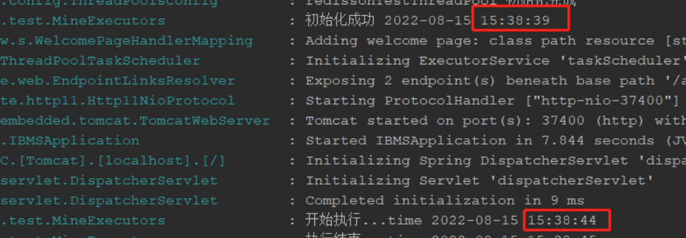
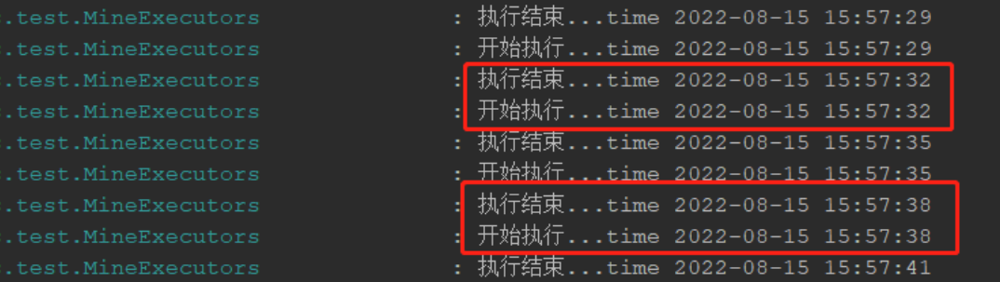
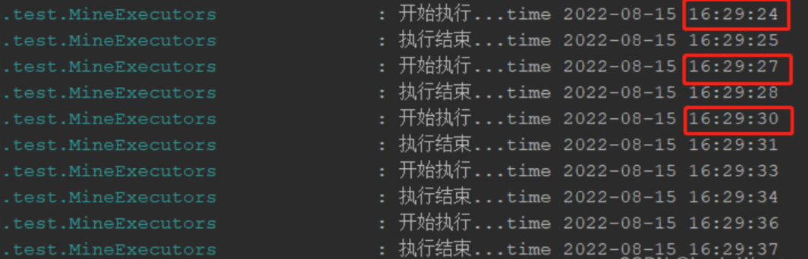
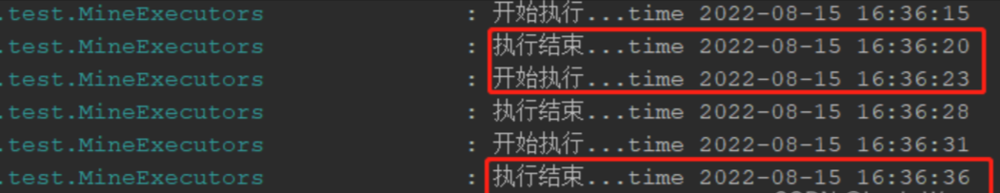

# ScheduledExecutorService

有线程池的特性，也可以实现任务循环执行，可以看作是一个简单地`定时任务`组件，因为有线程池特性，所以任务之间可以多线程并发执行，互不影响，当任务来的时候，才会真正创建线程去执行。

我们在做一些普通定时循环任务时可以用它，比如定时刷新字典常量，只需要不断重复执行即可，这篇文章讲解一下它的用法以及注意事项，不涉及底层原理。

:::tip

我们都知道，在使用线程池的时候，如果我们的任务出现异常没有捕获，那么线程会销毁被回收，不会影响其他任务继续提交并执行，但是在这里，如果你的任务出现异常没有捕获，会导致后续的任务不再执行，所以一定要 try...catch

:::

## 延迟不循环任务 schedule 方法

`schedule(Runnable command, long delay, TimeUnit unit)`

- **参数 1**：任务
- **参数 2**：方法第一次执行的延迟时间
- **参数 3**：延迟单位

**说明**：延迟任务，只执行一次（不会再次执行），参数 2 为延迟时间。

> 案例说明

```java
@Component
@Slf4j
public class MineExecutors {
    private final static ScheduledExecutorService executor = new ScheduledThreadPoolExecutor(1,
            new BasicThreadFactory.Builder().namingPattern("scheduled-pool-%d").daemon(true).build(),
            new ThreadPoolExecutor.AbortPolicy());
    private final static SimpleDateFormat format = new SimpleDateFormat("yyyy-MM-dd HH:mm:sss");

    @PostConstruct
    public void init() {
        executor.schedule(() -> {
            try {
                log.info("开始执行...time {}", format.format(new Date()));
                Thread.sleep(1000);
                log.info("执行结束...time {}", format.format(new Date()));
            } catch (Exception e) {
                log.error("定时任务执行出错");
            }
        }, 5, TimeUnit.SECONDS);
        log.info("初始化成功 {}", format.format(new Date()));
    }
}
```

可以看到任务执行时间为初始化完成后 5s 才开始执行，且只执行一次。



## 延迟且循环 scheduleAtFixedRate 方法

`scheduleAtFixedRate(Runnable command, long initialDelay, long period, TimeUnit unit)`

- **参数 1**：任务
- **参数 2**：初始化完成后延迟多长时间执行第一次任务
- **参数 3**：任务时间间隔
- **参数 4**：单位

**方法解释**：是以上一个任务开始的时间计时，比如 `period` 为 5，那 5 秒后，检测上一个任务是否执行完毕，如果上一个任务执行完毕，则当前任务立即执行，如果上一个任务没有执行完毕，则需要等上一个任务执行完毕后立即执行。如果你的任务执行时间超过 5 秒，那么任务时间间隔参数将无效，任务会不停地循环执行。**由此可得出该方法不能严格保证任务按一定时间间隔执行**。

> 错误：任务连续执行案例

```java
@Component
@Slf4j
public class MineExecutors {
    private final static ScheduledExecutorService executor = new ScheduledThreadPoolExecutor(1,
            new BasicThreadFactory.Builder().namingPattern("scheduled-pool-%d").daemon(true).build(),
            new ThreadPoolExecutor.AbortPolicy());
    private final static SimpleDateFormat format = new SimpleDateFormat("yyyy-MM-dd HH:mm:ss");

    @PostConstruct
    public void init() {
        executor.scheduleAtFixedRate(() -> {
            try {
                log.info("开始执行...time {}", format.format(new Date()));
                Thread.sleep(3000);
                log.info("执行结束...time {}", format.format(new Date()));
            } catch (Exception e) {
                log.error("定时任务执行出错");
            }
        }, 0, 2, TimeUnit.SECONDS);
        log.info("初始化成功 {}", format.format(new Date()));
    }
}
```

由上面代码可以看出，任务执行需要 3 秒，而我们设定的任务时间间隔为 2 秒，如此就会导致任务连续执行。**该方法不能严格保证任务按照规定的时间间隔执行，如果你的任务执行时间可以保证忽略不计，则可以使用该方法**。我们可以看到下面日志，上一个任务的执行结束时间与下一个任务的开始时间一致，所以任务连续循环执行了。



> 正确案例

```java
@Component
@Slf4j
public class MineExecutors {
    private final static ScheduledExecutorService executor = new ScheduledThreadPoolExecutor(1,
            new BasicThreadFactory.Builder().namingPattern("scheduled-pool-%d").daemon(true).build(),
            new ThreadPoolExecutor.AbortPolicy());
    private final static SimpleDateFormat format = new SimpleDateFormat("yyyy-MM-dd HH:mm:ss");

    @PostConstruct
    public void init() {
        executor.scheduleAtFixedRate(() -> {
            try {
                log.info("开始执行...time {}", format.format(new Date()));
                Thread.sleep(1000);
                log.info("执行结束...time {}", format.format(new Date()));
            } catch (Exception e) {
                log.error("定时任务执行出错");
            }
        }, 0, 3, TimeUnit.SECONDS);
        log.info("初始化成功 {}", format.format(new Date()));
    }
}
```

可以看到任务以上一次任务的开始时间，按 3 秒一次的方式执行。



## 严格按照一定时间间隔执行 scheduleWithFixedDelay

`scheduleWithFixedDelay(Runnable command, long initialDelay, long delay, TimeUnit unit);`

- **参数 1**：任务
- **参数 2**：初始化完成后延迟多长时间执行第一次任务
- **参数 3**：任务执行时间间隔
- **参数 4**：单位

**解释**：以上一次任务执行结束时间为准，加上任务时间间隔作为下一次任务开始时间，由此可以得出，**任务可以严格按照时间间隔执行**。

> 示例

```java
@Component
@Slf4j
public class MineExecutors {
    private final static ScheduledExecutorService executor = new ScheduledThreadPoolExecutor(5,
            new BasicThreadFactory.Builder().namingPattern("scheduled-pool-%d").daemon(true).build(),
            new ThreadPoolExecutor.AbortPolicy());
    private final static SimpleDateFormat format = new SimpleDateFormat("yyyy-MM-dd HH:mm:ss");

    @PostConstruct
    public void init() {
        executor.scheduleWithFixedDelay(() -> {
            try {
                log.info("开始执行...time {}", format.format(new Date()));
                Thread.sleep(5000);
                log.info("执行结束...time {}", format.format(new Date()));
            } catch (Exception e) {
                log.error("定时任务执行出错");
            }
        }, 0, 3, TimeUnit.SECONDS);
        log.info("初始化成功 {}", format.format(new Date()));
    }
}
```

由下图日志可以看出，下次任务的开始时间是在上一次任务结束时间 + 任务时间间隔为准的，严格按照任务时间间隔，规律执行。**如果你的任务需要保证严格的时间间隔，可以用该方法启动任务**。



其他用法与线程池没有差异了，例如 `ThreadFactory` 作为参数传入，自定义线程池内线程名称之类的，不多解释了。
