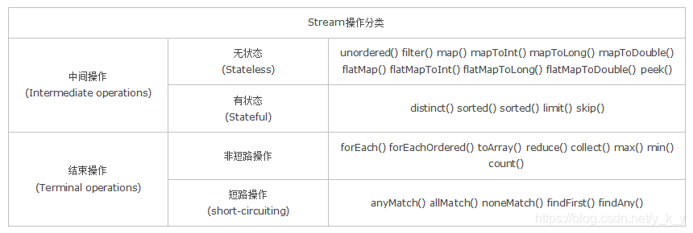

# steam

Stream 是 Java8 中处理集合的关键抽象概念，它可以指定你希望对集合进行的操作，可以执行非常复杂的查找、过滤和映射数据等操作。使用Stream API 对集合数据进行操作，就类似于使用 SQL 执行的数据库查询。也可以使用 Stream API 来并行执行操作。简而言之，Stream API 提供了一种高效且易于使用的处理数据的方式。
特点：

        1. 不是数据结构，不会保存数据。

        2. 不会修改原来的数据源，它会将操作后的数据保存到另外一个对象中。（保留意见：毕竟peek方法可以修改流中元素）

        3. 惰性求值，流在中间处理过程中，只是对操作进行了记录，并不会立即执行，需要等到执行终止操作的时候才会进行实际的计算。

## 分类



无状态：指元素的处理不受之前元素的影响；

    有状态：指该操作只有拿到所有元素之后才能继续下去。

    非短路操作：指必须处理所有元素才能得到最终结果；

    短路操作：指遇到某些符合条件的元素就可以得到最终结果，如 A || B，只要A为true，则无需判断B的结果。

## 对比

```java title="原始写法"
public class Demo1List{
    public static void main(String[] args){ 
        List<String> list = new ArrayList<>(); list.add("张无忌");
        list.add("周芷若");
        list.add("赵敏");
        list.add("小昭");
        list.add("殷离");
        list.add("张三");
        list.add("张三丰");

        List<String> listA=new ArrayList<>(); 
        for(String s:list){
            if (s.startsWith("张")){
                listA.add(s);
            }
        }
        List<String> listB=new ArrayList<>(); for (String s: listA) {
            if (s.length() == 3) listB.add(s);
        }
        for (String s: listB) { 
            System.out.println(s);
        }
    }
}
```

```java title="Stream写法"
public class Demo1List{
    public static void main(String[] args){ 
        List<String> list = new ArrayList<>();
        list.add("张无忌");
        list.add("周芷若");
        list.add("赵敏");
        list.add("小昭");
        list.add("殷离");
        list.add("张三");
        list.add("张三丰"); 
        list.stream()
            .filter(name -> name.startsWith("张"))
            .filter(name -> name.length() == 3)
            .forEach(name -> System.out.println(name));
    }
}
```

## 创建流

> 通过Collection的Stream()方法（串行流）或者parallelStream()(并行流)创建Stream 常用

```java
List list = Arrays.asList("1","2","3","4","0","222","33"); 
Stream<Integer> stream=list.stream();
stream.forEach(System.out::println);
```

> 通过Arrays中得静态方法stream()获取数组流

```java
int[] a = new int[] { 1, 2, 3, 4 }; 
IntStream s = Arrays.stream(a); 
s.forEach(System.out::print);//遍历输出
```

> 通过Stream类中的of()静态方法获取流

```java
Stream stream = Stream.of("a","b","c");
```

## 中间流

- 这里的流中间操作指的是该操作的返回值仍然是流
- 中间流操作需要有终结流结尾

| 操作 | 说明 | 备注 |
| -- | -- | -- |
| filter | 返回当前流中满足参数predicate过滤条件的元素组成的新流 | 过滤器 |
| map | 返回通过给定mapper作用于当前流的每个元素之后的结果组成的新流 | 函数 |
| mapToInt | 返回通过给定mapper作用于当前流的每个元素之后的结果组成的新的int流 | 函数 |
| mapToLong | 返回通过给定mapper作用于当前流的每个元素之后的结果组成的新的Long流 | 函数 |
| mapToDouble | 返回通过给定mapper作用于当前流的每个元素之后的结果组成的新的Double流 | 函数 |
| flatMap | 根据给定的mapper作用于当前流的每个元素，将结果组成新的流来返回 | 扁平函数 |
| flatMapToInt | 根据给定的mapper作用于当前流的每个元素，将结果组成新的Int流来返回 | 扁平函数 |
| flatMapToLong | 根据给定的mapper作用于当前流的每个元素，将结果组成新的Long流来返回 | 扁平函数 |
| flatMapToDouble | 根据给定的mapper作用于当前流的每个元素，将结果组成新的Double流来返回 | 扁平函数 |
| distinct | 返回去掉当前流中重复元素之后的新流 | 去重 |
| sorted | 返回当前流中元素排序之后的新流，需要元素类型实现Comparable | 排序 |
| sorted | 返回当前流中元素排序之后的新流，需要传递一个Comparator | 排序 |
| peek | 针对流中的每个元素执行操作action | 查阅 |
| limit | 返回指定的数量的元素组成的新流 | 限制 |
| skip | 返回第n个之后的元素组成的新流 | 跳过 |

### filter 过滤器

```java
List<Integer> list = Arrays.asList(6, 7, 3, 8, 1, 2, 9); 
Stream<Integer> stream = list.stream();
stream.filter(x -> x > 7).forEach(System.out::println);
```

### map 取流对象某个属性

```java
String[] strArr = { "abcd", "bcdd", "defde", "fTr" }; List<String> strList =
Arrays.stream(strArr).map(String::toUpperCase).collect(Collectors.toList());

List<Integer> intList=Arrays.asList(1,3,5,7,9,11);
List<Integer> intListNew=intList.stream().map(x -> x+3).collect(Collectors.toList());

System.out.println("每个元素大写：" + strList); System.out.println("每个元素+3：" + intListNew);
```

### distinct 去重

```java
String[] arr1={"a","b","c","d"};
String[] arr2={"d","e","f","g"}; 
Stream<String> stream1 = Stream.of(arr1);
Stream<String> stream2 = Stream.of(arr2);
// concat:合并两个流 distinct：去重
List<String> newList = Stream.concat(stream1, stream2).distinct().collect(Collectors.toList());
```

### limit 截取

```java
// limit：截取从流中获得前n个数据
List<Integer> collect = Stream.iterate(1, x -> x + 2).limit(10).collect(Collectors.toList());
System.out.println("limit：" + collect);//[1, 3, 5, 7, 9, 11, 13, 15, 17, 19]
```

### skip 跳过

```java
//skip：跳过前n个数据
List<Integer> collect2 = Stream.iterate(1, x -> x + 2).skip(1).limit(5).collect(Collectors.toList());
System.out.println("skip：" + collect2);//[3, 5, 7, 9, 11]
```

### sorted 排序

```java title="简单排序"
List<Integer> list=Arrays.asList(1,3,5,2,4);
List<Integer> mList = lList.stream().sorted().collect(Collectors.toList());
System.out.println(mList);	// [1, 2, 3, 4, 5]
```

> 复杂排序

```java title="实体类"
package com.shucha.deveiface.biz.dto;
 
import lombok.Data;

@Data
public class SortData {
    //姓名
    private String name;
    //年龄
    private Integer age;
    //年份
    private String yearStr;
}
```

```java title="排序示例"
package com.shucha.deveiface.biz.test;
 
import com.alibaba.fastjson.JSON;
import com.shucha.deveiface.biz.dto.SortData;
 
import java.util.ArrayList;
import java.util.Comparator;
import java.util.List;
import java.util.stream.Collectors;
 
/**
 * @author tqf
 * @Description java8新特性stream进行处理-排序
 * @Version 1.0
 * @since 2022-07-07 14:26
 */
public class SortDataTest {
    public static void main(String[] args) {
        String nameArray[] = {"张三","李四","王五","谭海","王杰"};
        List<SortData> list = new ArrayList<>();
        for (int i=0;i<5;i++) {
            SortData sortData = new SortData();
            sortData.setAge(i+10);
            sortData.setName(nameArray[i]);
            sortData.setYearStr(String.valueOf(i));
            list.add(sortData);
        }
        // 1. Comparator.comparing(类::属性一).reversed();
        // 2. Comparator.comparing(类::属性一,Comparator.reverseOrder());
 
        test(list);
        test1(list);
        test2(list);
        test3(list);
        test4(list);
        test5(list);
    }
 
    /**
     * 对象集合以类属性一升序排序
     * @param list
     */
    public static void test(List<SortData> list){
        // list.stream().sorted(Comparator.comparing(类::属性));
        list = list.stream().sorted(Comparator.comparing(SortData::getAge))
                .collect(Collectors.toList());
        System.out.println(JSON.toJSONString(list));
    }
 
    /**
     * 先以属性一升序,结果进行属性一降序  2种写法
     * @param list
     */
    public static void test1(List<SortData> list){
        // 1、先以年龄升序,结果进行年龄降序 list.stream().sorted(Comparator.comparing(类::属性).reversed())
        List<SortData> result = list.stream().sorted(Comparator.comparing(SortData::getAge).reversed())
                .collect(Collectors.toList());
        System.out.println(JSON.toJSONString(result));
 
        // 2、以年龄降序 list.stream().sorted(Comparator.comparing(类::属性一,Comparator.reverseOrder()))
        List<SortData> result2 = list.stream().sorted(Comparator.comparing(SortData::getAge, Comparator.reverseOrder()))
                .collect(Collectors.toList());
        System.out.println(JSON.toJSONString(result2));
    }
 
    /**
     * 对象集合以类属性一升序 属性二升序
     * @param list
     */
    public static void test2(List<SortData> list) {
        // list.stream().sorted(Comparator.comparing(类::属性一).thenComparing(类::属性二));
        list = list.stream().sorted(Comparator.comparing(SortData::getAge)
                .thenComparing(SortData::getYearStr))
                .collect(Collectors.toList());
        System.out.println(JSON.toJSONString(list));
    }
 
    /**
     * 对象集合以类属性一降序 属性二升序 注意两种写法
     * @param list
     */
    public static void test3(List<SortData> list) {
        // 先以属性一升序,升序结果进行属性一降序,再进行属性二升序
        // list.stream().sorted(Comparator.comparing(类::属性一).reversed().thenComparing(类::属性二));
        List<SortData> result = list.stream().sorted(Comparator.comparing(SortData::getAge).reversed()
                .thenComparing(SortData::getYearStr)).collect(Collectors.toList());
        System.out.println(JSON.toJSONString(result));
 
        // 先以属性一降序,再进行属性二升序
        // list.stream().sorted(Comparator.comparing(类::属性一,Comparator.reverseOrder()).thenComparing(类::属性二));
        List<SortData> result2 = list.stream().sorted(Comparator.comparing(SortData::getAge,Comparator.reverseOrder())
                .thenComparing(SortData::getYearStr)).collect(Collectors.toList());
        System.out.println(JSON.toJSONString(result2));
    }
 
    /**
     * 对象集合以类属性一降序 属性二降序 注意两种写法
     * @param list
     */
    public static void test4(List<SortData> list){
        // 先以属性一升序,升序结果进行属性一降序,再进行属性二降序
        // list.stream().sorted(Comparator.comparing(类::属性一).reversed().thenComparing(类::属性二,Comparator.reverseOrder()));
        List<SortData> result = list.stream().sorted(Comparator.comparing(SortData::getAge).reversed()
                .thenComparing(SortData::getYearStr,Comparator.reverseOrder())).collect(Collectors.toList());
        System.out.println(JSON.toJSONString(result));
 
        // 先以属性一降序,再进行属性二降序
        // list.stream().sorted(Comparator.comparing(类::属性一,Comparator.reverseOrder()).thenComparing(类::属性二,Comparator.reverseOrder()));
        List<SortData> result2 = list.stream().sorted(Comparator.comparing(SortData::getAge,Comparator.reverseOrder())
                .thenComparing(SortData::getYearStr,Comparator.reverseOrder())).collect(Collectors.toList());
        System.out.println(JSON.toJSONString(result2));
    }
 
    /**
     * 对象集合以类属性一升序 属性二降序 注意两种写法
     * @param list
     */
    public static void test5(List<SortData> list) {
        // 先以属性一升序,升序结果进行属性一降序,再进行属性二升序,结果进行属性一降序属性二降序
        // list.stream().sorted(Comparator.comparing(类::属性一).reversed().thenComparing(类::属性二).reversed());
        List<SortData> result = list.stream().sorted(Comparator.comparing(SortData::getAge).reversed()
                .thenComparing(SortData::getYearStr).reversed()).collect(Collectors.toList());
        System.out.println(JSON.toJSONString(result));
 
        // 先以属性一升序,再进行属性二降序
        // list.stream().sorted(Comparator.comparing(类::属性一).thenComparing(类::属性二,Comparator.reverseOrder()));
        List<SortData> result2 = list.stream().sorted(Comparator.comparing(SortData::getAge)
                .thenComparing(SortData::getYearStr,Comparator.reverseOrder())).collect(Collectors.toList());
        System.out.println(JSON.toJSONString(result2));
    }
}
```

### peek 遍历流对象，返回流

遍历流对象，返回流

## 终结流

:::tip 

使用终结流之后该流结束了，不会再返回流

:::

```java title="示例中用到的实体类"

import lombok.Data;

@Data
class Person {
    //姓名
    private String name;
    //工资
    private Integer salary;
    //性别
    private String sex;
    //区域
    private String area;
}

```

### forEach

```java
List<Integer> list = Arrays.asList(7, 6, 9, 3, 8, 2, 1);
// 遍历输出符合条件的元素
list.stream().filter(x -> x > 6).forEach(System.out::println);
```

### count

```java
List<Integer> list=Arrays.asList(7,6,4,8,2,11,9); 
long count=list.stream().filter(x->x>6).count(); 
System.out.println("list中大于6的元素个数："+count);
```

### max

```java
List<Integer> list=Arrays.asList(7,6,9,4,11,6);
//自然排序
Optional<Integer> max=list.stream().max(Integer::compareTo);
//自定义排序
Optional<Integer> max2=list.stream().max(
    new Comparator<Integer>(){ 
        @Override
        public int compare(Integer o1, Integer o2) {
            return o1.compareTo(o2);
        }
    });
System.out.println("自然排序的最大值："+max.get()); //自然排序的最大值：11 
System.out.println("自定义排序的最大值："+max2.get());//自定义排序的最大值：11
```

### min

```java
List<Integer> list=Arrays.asList(7,6,9,4,11,6);
//自然排序
Optional<Integer> max=list.stream().min(Integer::compareTo);
//自定义排序
Optional<Integer> max2=list.stream().min(
    new Comparator<Integer>(){ 
        @Override
        public int compare(Integer o1, Integer o2) {
            return o1.compareTo(o2);
        }
    });
System.out.println("自然排序的最小值："+max.get()); //自然排序的最小值：4
System.out.println("自定义排序的最小值："+max2.get());//自定义排序的最小值：4
```

### collect(toList,toSet,toMap)

```java
List<Integer> list=Arrays.asList(1,6,3,4,6,7,9,6,20);
List<Integer> listNew=list.stream().filter(x —> x%2==0).collect(Collectors.toList());
Set<Integer> set=list.stream().filter(x—>x%2==0).collect(Collectors.toSet());

List<Person> personList=new ArrayList<Person>(); 
personList.add(new Person("Tom",8900,23,"male","New York")); 
personList.add(new Person("Jack",7000,25,"male","Washington"));
personList.add(new Person("Lily", 7800, 21, "female", "Washington"));
personList.add(new Person("Anni", 8200, 24, "female", "New York"));

Map<String,Person> map=personList.stream().filter(p —> p.getSalary() > 8000).collect(Collectors.toMap(Person::getName,p -> p)); 
System.out.println("toList:" + listNew);
System.out.println("toSet:" + set); 
System.out.println("toMap:" + map);
```

### partitioningBy、groupingBy

```java
List<Person> personList=new ArrayList<Person>();
personList.add(new Person("Tom",8900,"male","New York"));
personList.add(new Person("Jack",7000,"male","Washington"));
personList.add(new Person("Lily",7800,"female","Washington"));
personList.add(new Person("Anni",8200,"female","New York"));
personList.add(new Person("Owen", 9500, "male", "New York"));
personList.add(new Person("Alisa", 7900, "female", "New York"));

//将员工按薪资是否高于8000分组
Map<Boolean, List<Person>> part = personList.stream().collect(Collectors.partitioningBy(x -> x.getSalary() > 8000));
// 将员工按性别分组
Map<String, List<Person>> group = personList.stream().collect(Collectors.groupingBy(Person::getSex));
// 将员工先按性别分组，再按地区分组
Map<String, Map<String, List<Person>>> group2 = personList.stream().collect(Collectors.groupingBy(Person::getSex, Collectors.groupingBy(Person::getArea)));
System.out.println("员工按薪资是否大于8000分组情况：" + part);
System.out.println("员工按性别分组情况：" + group);
System.out.println("员工按性别、地区：" + group2);
```

### reduce

reduce方法有三种形式

1、 `reduce(BinaryOperator<T> accumulator)`

```java
// 该方法使用一个二元运算符，将流中的所有元素两两结合，最终得到一个Optional类型的结果。
List<Integer> numbers = Arrays.asList(1, 2, 3, 4, 5);
Optional<Integer> sum = numbers.stream().reduce(Integer::sum);
sum.ifPresent(System.out::println); // 输出: 15
```

2、 `reduce(T identity, BinaryOperator<T> accumulator)`

```java
// 该方法除了二元运算符外，还需要一个标识值。标识值作为起始值参与计算，最终得到的结果为非Optional类型。
List<Integer> numbers = Arrays.asList(1, 2, 3, 4, 5);
int sum = numbers.stream().reduce(0, Integer::sum);
System.out.println(sum); // 输出: 15
```

3、 `reduce(U identity, BiFunction<U, ? super T, U> accumulator, BinaryOperator<U> combiner)`

```java
// 该方法适用于并行流。它接受三个参数：一个标识值、一个累加器函数和一个组合器函数。累加器函数用于将元素累加到结果，组合器函数用于在并行流中合并部分结果。
List<Integer> numbers = Arrays.asList(1, 2, 3, 4, 5);
int sum = numbers.stream().reduce(0, Integer::sum, Integer::sum);
System.out.println(sum); // 输出: 15
```

4、 使用示例

下面是一些实际使用reduce方法的示例。

示例1：计算列表中所有数字的和

```java
List<Integer> numbers = Arrays.asList(1, 2, 3, 4, 5);
int sum = numbers.stream().reduce(0, Integer::sum);
System.out.println(sum); // 输出: 15
```

示例2：计算列表中所有数字的乘积

```java
List<Integer> numbers = Arrays.asList(1, 2, 3, 4, 5);
int product = numbers.stream().reduce(1, (a, b) -> a * b);
System.out.println(product); // 输出: 120
```

示例3：找出列表中的最大值

```java
List<Integer> numbers = Arrays.asList(1, 2, 3, 4, 5);
Optional<Integer> max = numbers.stream().reduce(Integer::max);
max.ifPresent(System.out::println); // 输出: 5
```

示例4：拼接字符串

```java
List<String> words = Arrays.asList("Java", "is", "awesome");
String concatenated = words.stream().reduce("", (a, b) -> a + " " + b).trim();
System.out.println(concatenated); // 输出: "Java is awesome"
```

