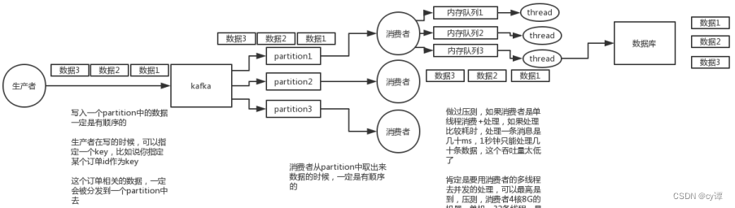
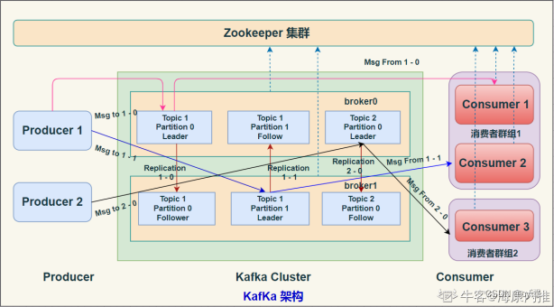
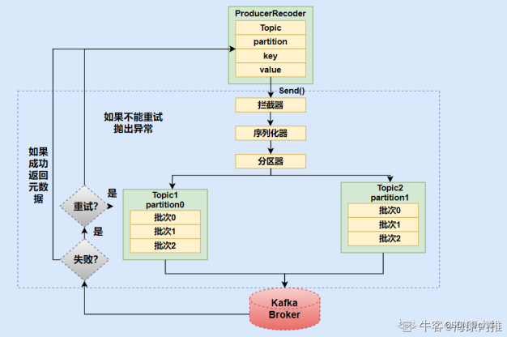
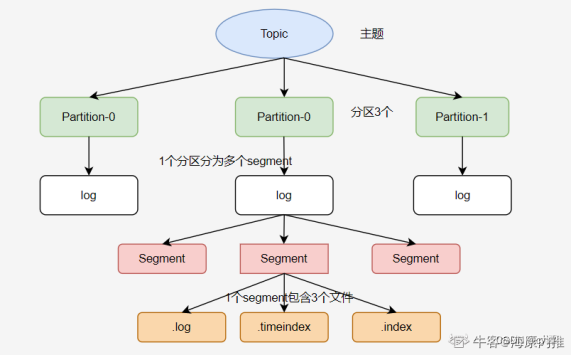
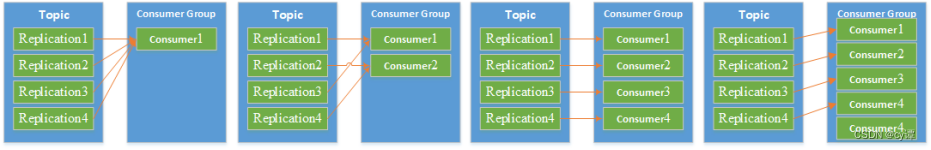

# Kafka

## 1 介绍

Kafka 起初是由 Linkedin 公司采用 Scala 语言开发的一个多分区、多副本且基于 ZooKeeper 协调的分布式消息系统。目前 Kafka 已经定位为一个分布式流式处理平台，它以高吞吐、可持久化、可水平扩展、支持流数据处理等多种特性而被广泛使用。

### 1.1 Kafka的优点

- 高吞吐量、低延迟：kafka每秒可以处理几十万条消息，它的延迟最低只有几毫秒
- 可扩展性：kafka集群支持热扩展
- 持久性、可靠性：消息被持久化到本地磁盘，并且支持数据备份防止数据丢失
- 容错性：允许集群中节点失败（若副本数量为n,则允许n-1个节点失败）
- 高并发：支持数千个客户端同时读写
- 支持复杂系统：支持多个生产者，多消费者

### 1.2 Kafka的缺点

- 消息乱序

分布式的单位是partition，同一个partition可以保证FIFO的顺序，不同partition之间不能保证顺序。



- 消息积压

容易造成消息挤压

- 生态不完善

1. 不支持mqtt协议，导致一些重要场景用不了
2. 监控不完善，需要安装插件
3. 需要配合zookeeper进行元数据管理

## 2 kafka 的架构



### 2.1 概念的说明

#### 2.1.1 Broker 代理

一个独立的Kafka服务器被称作broker，broker 负责接收来自生产者的消息，为消息设置偏移量，并将消息存储在磁盘。
broker 为消费者提供服务，对读取分区的请求作出响应，返回已经提交到磁盘上的消息。

Zookeeper是分布式协调服务，负责保存broker集群元数据，并对控制器进行选举等操作。

#### 2.1.2 Producer 生产者

负责创建消息，将消息发送到 Broker。

#### 2.1.3 Consumer 消费者

负责从Broker订阅并消费消息。

#### 2.1.4 Consumer Group 消费者组

一个消费者组可以包含一个或多个Consumer。同一消费者组中的消费者不会重复消费消息。

#### 2.1.5 Topic 主题

Kafka中的消息以Topic为单位进行划分，生产者将消息发送到特定的 Topic，而消费者负责订阅 Topic 的消息并进行消费。

#### 2.1.6 Partition 分区

一个 Topic 可以细分为多个分区，每个分区只属于单个主题，类似数据库的分库（topic）分表(Partition)

#### 2.1.7 Offset 偏移量

offset 是消息在分区中的唯一标识，Kafka 通过它来保证消息在分区（Partition）内的顺序性。

#### 2.1.8 Replication 副本

副本，是 Kafka 保证数据高可用的方式，Kafka 同一Partition(分区)的数据可以在多Broker上存在多个副本，通常只有主副本对外提供读写服务。
当主副本所在 broker 崩溃或发生网络异常，Kafka 会在 Controller 的管理下会从多个follower中选择一个变成 Leader 副本对外提供读写服务。

### 2.2 kafka如何做到高吞吐量和性能

#### 2.2.1 页缓存技术

Kafka是基于 操作系统 的页缓存来实现文件写入的，操作系统本身有一层缓存，叫做 page cache，是在 内存里的缓存，我们也可以称之为 os cache，意思就是操作系统自己管理的缓存。
Kafka 在写入磁盘文件的时候，可以直接写入这个 os cache 里，也就是仅仅写入内存中
接下来由操作系统自己决定什么时候把 os cache 里的数据真的刷入磁盘文件中。
通过这一个步骤，就可以将磁盘文件写性能提升很多了，因为其实这里相当于是在写内存，不是在写磁盘，所以速度快。

#### 2.2.2 磁盘顺序写

kafka 写数据的时候，是以磁盘顺序写的方式来写的。也就是说，仅仅将数据追加到文件的末尾，不是在文件的随机位置来修改数据。

基于上面两点，kafka 就实现了写入数据的超高性能。

#### 2.2.3 零拷贝

Kafka 里经常要消费数据，那么消费的时候实际上就是要从 kafka 的磁盘文件里读取某条数据然后发送给下游的消费者
那么这里如果频繁的从磁盘读数据然后发给消费者，会增加两次没必要的拷贝
一次是从操作系统的cache里拷贝到应用进程的缓存里，接着又从应用程序缓存里拷贝回操作系统的Socket缓存里，因此读取数据比较消耗性能

Kafka 为了解决这个问题，在读数据的时候是引入零拷贝技术。
即直接让操作系统的cache中的数据发送到网卡后传输给下游的消费者，跳过了两次拷贝步骤，大大地提升了消费数据时读取文件数据的性能

kafka 集群经过良好的调优，数据直接写入 os cache 中，然后读数据的时候也是从 os cache 中读。相当于 Kafka 完全基于内存提供数据的写和读了，所以这个整体性能会极其的高。

### 2.3 kafka 元数据(MetaData)

- 服务器活动状态
- Topic和Topic的分区
- Partition都有哪些Replication
- 哪个Replication是Leader

### 2.4 kafka 和 zookeeper 之间的关系

kafka 使用 zookeeper 来保存集群的元数据信息和消费者信息(偏移量)，没有 zookeeper，kafka 是工作不起来。 在zookeeper上会有一个专门用来进行Broker服务器列表记录的点，节点路径为/brokers/ids。
每个 Broker 服务器在启动时，都会到 Zookeeper 上进行注册，即创建/brokers/ids/[0-N]的节点，然后写入 IP，端口等信息，Broker 创建的是临时节点，所以一旦 Broker 上线或者下线，对应 Broker 节点也就被删除了，因此可以通过 zookeeper 上 Broker 节点的变化来动态表征 Broker 服务器的可用性。

### 2.5 生产者向 Kafka 发送消息的执行流程



1. 生产者要往 Kafka 发送消息时，需要创建 ProducerRecoder
2. 生产者在将消息发送到某个 Topic ，需要经过拦截器、序列化器和分区器（Partitioner）。
3. 分区选择好之后，会将消息添加到一个记录批次中，然后会有一个独立的线程负责把这些记录批次发送到相应的 broker 中。
4. broker 接收到 Msg 后，会作出一个响应。若写入失败，就返回一个错误异常，生产者在收到错误之后尝试重新发送消息，几次之后如果还失败，就返回错误信息。

### 2.6 kafka 文件存储机制



Kafka 会根据log.segment.bytes的配置来决定单个 Segment 文件（log）的大小，当写入数据达到这个大小时就会创建新的 Segment 。

### 2.7 kafka包含三种分区算法

- 轮询策略

顺序分配。比如一个 topic 下有 3 个分区，那么第一条消息被发送到分区 0，第二条被发送到分区 1，第三条被发送到分区 2，以此类推

- 随机策略

也称 Randomness 策略。所谓随机就是我们随意地将消息放置在任意一个分区上

- 按key分配策略

kafka允许为每条消息定义消息键，简称为key。一旦消息被定义了key，那么你就可以保证同一个key的所有消息都进入到相同的分区里面（有序）

### 2.8 Kafka如何保证可靠性

生产者往Broker 的 topic 中发送消息时，可以通过配置来决定有几个副本收到这条消息才算消息发送成功

acks = 0：producer 不会等待任何来自 broker 的响应
acks = 1（默认值）：只要集群中 partition 的 Leader 节点收到消息，生产者就会收到一个来自服务器的成功响应。
acks = -1：只有当所有参与复制的节点全部都收到消息时，生产者才会收到一个来自服务器的成功响应。

如果要保证
- 发送消息设置成同步模式
- 应答机制选acks = -1 （所有参与复制副本都收到）

### 2.9 Kafka如何保证幂等性

kafka消费消息时支持三种模式：
批量拉取消息
- at most once 模式 最多一次。保证每一条消息 commit 成功之后，再进行消费处理。消息可能会丢失，但不会重复。 【先提交再处理】
- at least once 模式 至少一次。保证每一条消息处理成功之后，再进行commit。消息不会丢失，但可能会重复。 【先处理再提交】
- exactly once 模式 精确传递一次。将 offset 作为唯一 id 与消息同时处理，并且保证处理的原子性。消息只会处理一次，不丢失也不会重复。但这种方式很难做到。
kafka 默认的模式是 at least once ，但这种模式可能会产生重复消费的问题，所以在业务逻辑必须做幂等设计

:::tip
如果要保证：消息消费业务逻辑做幂等设计
:::

### 2.10 kafka 事务

Kafka 在 0.11版本引入事务支持
为了实现跨分区跨会话事务，需要引入一个全局唯一的Transaction ID,并将 Producer 获取的 PID 和 Transaction ID 绑定

Kafka的事务特性就是要确保跨分区的多个写操作的原子性

### 2.11 kafka的消费者组跟分区

分区会平均分配到消费者组。只有一个消费者组时，它会收到所有分区的消息，消费者数量多于分区数量，那么多余的消费者将会被闲置
一个 partition只能被一个组内的一个 consumer 消费。



如果想实现多线程的消费
- 生产者随机分区提交数据(自定义随机分区)。
- 消费者修改单线程模式为多线程，在消费方面得注意，每个线程得遍历所有分区，否则还是只消费了一个区。

### 2.12 kafka常见问题与解决方案

1. 消息丢失

要求消息一定不丢失，从三个方面设置：
    1. 生产者端，使用更高等级的确认机制，如所有参与复制的节点全部都收到消息，生产者才会收到一个来自服务器的成功响应
    2. broker端，消息落盘再回复成功。而且Replication 数一定要大于1, 保证每个分区有多个副本。
    3. 消费者端，必须要等消息处理完毕再提交。

2. 消息重复

消费者消费到重复的消息，解决办法：
    1. 生产者只发送一次（不能保证消息不丢失）
    2. 保证消费端消费的幂等性，例如缓存消息唯一标识到redis，消费时先检查
    3. 加快消费处理，心跳超时会导致消息重复消费（心跳周期内要完成一次最大max-poll-records记录提交）

3. 消息乱序

首先消息乱序的主要原因是：分布式的单位是partition，同一个partition可以保证FIFO的顺序，不同partition之间不能保证顺序。
解决方式：
    1. 发送端采用同步发送方式，使用acks =-1（所有参与复制的节点全部都收到消息才回应发送成功）
    2. Broker端就要设置Topic为单分区的形式，这样就能保证同一个Topic消息有序
    3. 同类别消息有同样的Key，就会保证被分配到同样的分区中，也就保证了有序（对分区的数量进行改变的时候会打乱旧分区数据，需要注意）
    4. 尽量不让 Rebalance 发生，Rebalance 相当于让消费者组重新分配分区，会带前后分区不一致，影响顺序消费

4. 消息积压

消息积压的原因无非是消费能力与生产能力不匹配
解决方式：
    1. 垂直扩展，先从业务逻辑上优化，能批量执行的，则先批量执行，提高单线程处理能力。
    2. 水平扩容，垂直扩展还是没法提高，只能水平扩容(多线程处理)。
    3. 预消费，可以先用一个服务将消息快速消费后存放到一个临时的mq或者内存队列，然后再慢慢消费。
    4. 保证消费端的消费性能要高于生产端的发送性能，这样系统才能健康的持续运行

### 2.13 kafka优先级消息设计

kafka本身是不支持优先级消息

## windows

> 启动命令

```bash
.\bin\windows\kafka-server-start.bat .\config\server.properties
```

> 开启IP访问配置

要使用IP访问kafka需要开放host port，在server.properties下面配置：

```conf
# Hostname and port the broker will advertise to producers and consumers. If not set, 
# it uses the value for "listeners" if configured.  Otherwise, it will use the value
# returned from java.net.InetAddress.getCanonicalHostName().
advertised.listeners=PLAINTEXT://your.host.name:9092
```

## kafka文章

这边文章生动形象的说明了kafka使用中遇到的常见问题，以及针对出现的问题的解决方案和思路的详细说明。

https://mp.weixin.qq.com/s/aElO_L2HpYvZRuxxbYlqJw
