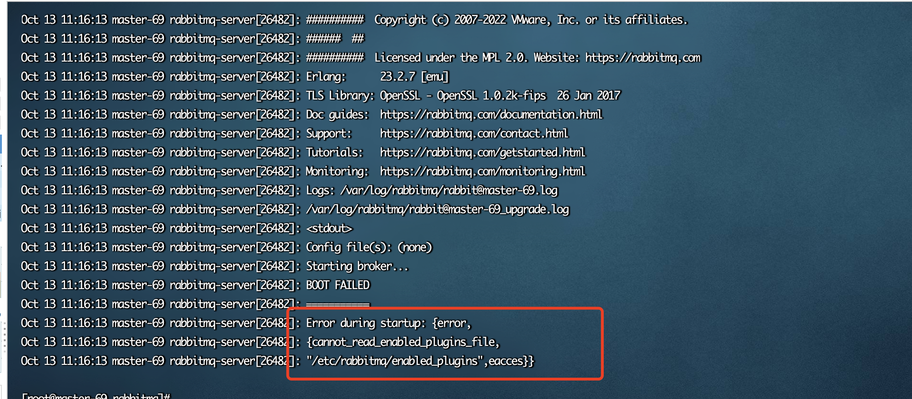
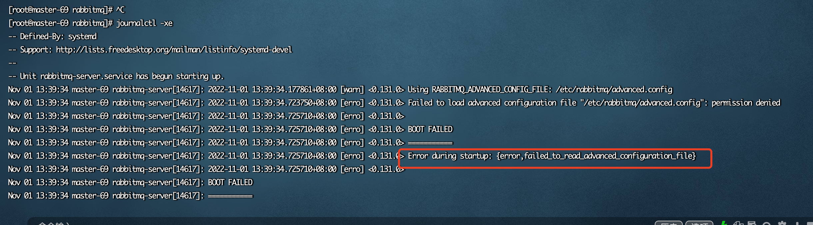
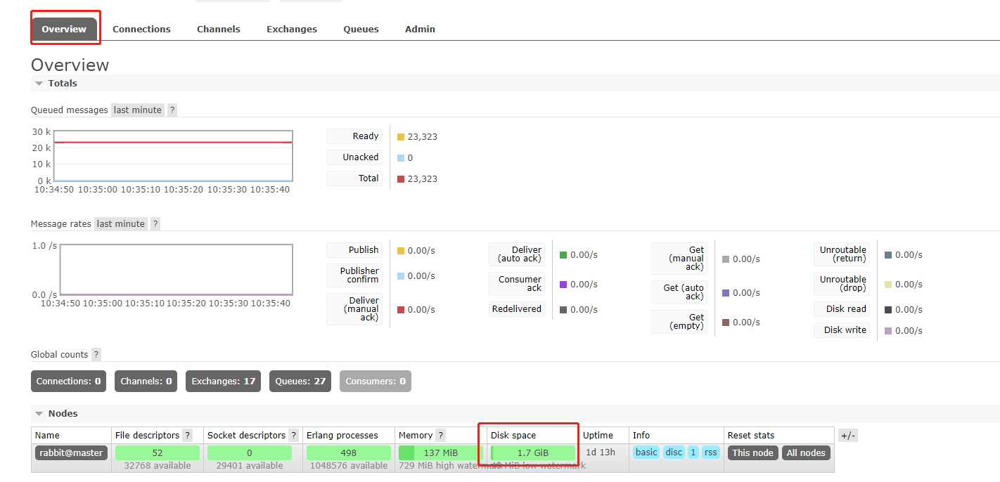
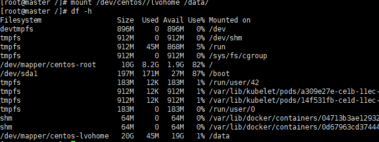
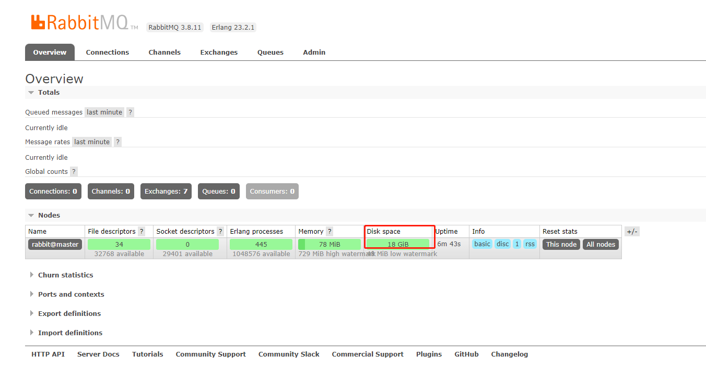
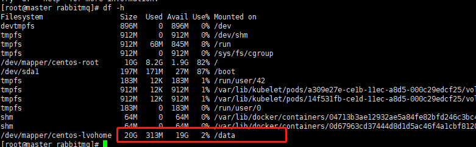

# RabbitMQ 常见问题

## 权限相关问题

### cannot_read_enabled_plugins_file

使用 `journalctl -xe` 查看报错，出现如下信息：



**解决方案：**

```bash
chown rabbitmq:rabbitmq /etc/rabbitmq/enabled_plugins
```

### failed_to_read_advanced_configuration_file



advanced.config 配置文件权限问题，执行如下命令，然后重启 rabbitmq 服务：

```bash
chown rabbitmq:rabbitmq /etc/rabbitmq/advanced.config
systemctl restart rabbitmq-server.service
```

## 修改日志和数据存储路径

### 背景

RabbitMQ 服务部署之后，默认的 disk space 空间一般是 `/dev/mapper/centos-root` 挂载到 `/` 下的磁盘空间。RabbitMQ 使用期间，如果数据量比较大的情况下，磁盘空间可能不够用，于是企业一般会在服务器上挂载有专门存储文件的磁盘卷。

::: warning 重要提示
因为数据日志路径修改后，原来的 RabbitMQ 相关用户及数据信息会丢失，因此建议 RabbitMQ 第一次进行搭建时，进行修改，否则会造成用户数据丢失。
:::

### 步骤

#### 1. 查看原本 RabbitMQ 磁盘路径

服务器磁盘容量：


RabbitMQ 管理界面的监控磁盘剩余容量：



可以看出 RabbitMQ 默认安装后，监控的是 `/dev/mapper/centos-root` 下的剩余磁盘容量。

#### 2. 查看 Linux 磁盘挂载

集群各节点查看 Linux 磁盘挂载，为了演示，此处我们把 RabbitMQ 默认数据存放路径改为 `/data` 下指定目录：

```bash
df -h
```



#### 3. 创建自定义目录并授权

集群各节点创建自定义 RabbitMQ 数据以及日志存放目录，并授权：

```bash
# 进入 data 目录
cd /data

# 创建 rabbitmq 目录
mkdir rabbitmq

# 创建日志和数据路径
mkdir -p /data/rabbitmq/{data,log}

# 目录授权，此步骤在 RabbitMQ 安装成功后操作
chown -R rabbitmq:rabbitmq /data/rabbitmq
```

#### 4. 修改配置文件

修改 `/etc/rabbitmq/rabbitmq-env.conf`：

```bash
vim /etc/rabbitmq/rabbitmq-env.conf
```

添加以下内容：

```ini
RABBITMQ_MNESIA_BASE=/data/rabbitmq/data
RABBITMQ_LOG_BASE=/data/rabbitmq/log
```

#### 5. 重启 RabbitMQ

```bash
systemctl restart rabbitmq-server.service
```

::: tip 注意
如果忘记执行 `chown -R rabbitmq:rabbitmq /data/rabbitmq` 或者 `rabbitmq-env.conf` 中日志或数据路径错误，会报以下错误：

```
Job for rabbitmq-server.service failed because the control process exited with error code. See "systemctl status rabbitmq-server.service" and "journalctl -xe" for details.
```
:::

#### 6. 验证更新

::: tip
可以将原来的文件夹复制过去，如果已删除，则修改日志文件路径后，日志信息及用户信息会丢失，需要重新创建用户。创建用户请参考[安装文档](./install-config)。
:::



此时登录页面，发现磁盘空间已经变成 18G，与我们新挂载的 data 下的空间接近：



## 其他常见问题

### 服务无法启动

1. 检查端口是否被占用：
   ```bash
   netstat -tlnp | grep -E '5672|15672'
   ```

2. 查看详细日志：
   ```bash
   journalctl -xe -u rabbitmq-server
   ```

3. 检查文件权限：
   ```bash
   ls -la /etc/rabbitmq/
   ls -la /var/lib/rabbitmq/
   ```

### 集群节点无法加入

1. 确保 `.erlang.cookie` 文件一致
2. 检查 hosts 文件配置
3. 确认网络连通性
4. 检查防火墙设置

### 管理界面无法访问

1. 确认已启用管理插件：
   ```bash
   rabbitmq-plugins list | grep management
   ```

2. 如未启用，执行：
   ```bash
   rabbitmq-plugins enable rabbitmq_management
   ```

3. 检查防火墙是否开放 15672 端口

### 内存占用过高

1. 调整内存限制配置
2. 检查消息堆积情况
3. 考虑集群扩容

## 完善建议

根据现有内容，建议补充以下内容：

1. **备份与恢复**
   - 如何备份 RabbitMQ 数据
   - 如何从备份恢复

2. **性能调优**
   - 消息持久化优化
   - 连接池配置
   - 流量控制

3. **监控与告警**
   - 关键监控指标
   - 常用监控工具集成

4. **安全加固**
   - TLS/SSL 配置
   - 用户权限最佳实践
   - 网络隔离建议
