# 配置

## 登录用户
如果需要登录系统，必须配置tomcat用户，在安装完Tomcat后，进行如下操作

在/conf/tomcat-users.xml文件中的&lt;tomcat-users&gt;标签里面添加如下内容

```xml
<!-- 修改配置文件，配置tomcat的管理用户 -->
<role rolename="manager"/>
<role rolename="manager-gui"/>
<role rolename="admin"/>
<role rolename="admin-gui"/>
<user username="tomcat" password="tomcat" roles="admin-gui,admin,manager-gui,manager"/>
```
如果是tomcat7，配置了tomcat用户就可以登录系统了，但是tomcat8中不行，还需要修改另一个配置文件，否则访问不了，提示403，打开webapps/manager/META-INF/context.xml文件
```xml
<!-- 将Valve标签的内容注释掉，保存退出即可 -->
<?xml version="1.0" encoding="UTF-8"?>

<Context antiResourceLocking="false" privileged="true" >
  <!--<Valve className="org.apache.catalina.valves.RemoteAddrValve"
         allow="127\.\d+\.\d+\.\d+|::1|0:0:0:0:0:0:0:1" />-->
  <Manager sessionAttributeValueClassNameFilter="java\.lang\.(?:Boolean|Integer|Long|Number|String)|org\.apache\.catalina\.filters\.CsrfPreventionFilter\$LruCache(?:\$1)?|java\.util\.(?:Linked)?HashMap"/>
</Context>

```

打开浏览器进行访问10.172.0.202:8080

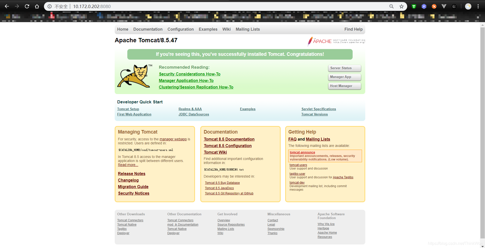

点击“Server Status”，输入用户名、密码进行登录，tomcat/tomcat

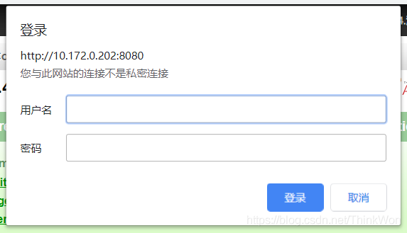

登录之后可以看到服务器状态等信息，主要包括服务器信息，JVM，ajp和http信息

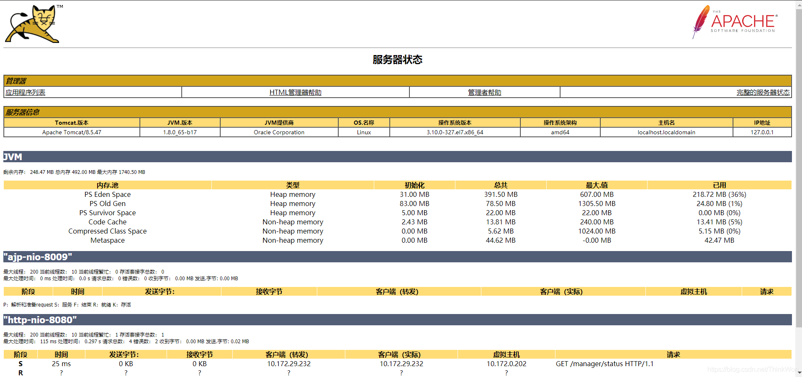

## AJP连接

在服务状态页面中可以看到，默认状态下会启用AJP服务，并且占用8009端口。

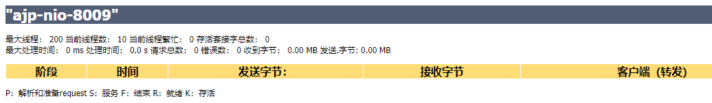

### 什么是AJP

AJP（Apache JServer Protocol）
AJPv13协议是面向包的。WEB服务器和Servlet容器通过TCP连接来交互；为了节省SOCKET创建的昂贵代价，WEB服务器会尝试维护一个永久TCP连接到servlet容器，并且在多个请求和响应周期过程会重用连接。

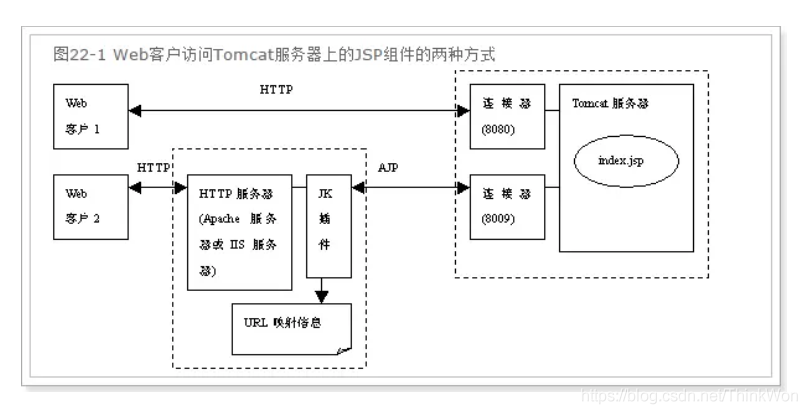

## 注册windows服务

:::tip
由于xp之后的windows改变了权限策略，注册windows服务需要管理员权限，必须以管理员权限打开cmd窗口，才能注册成功。
:::

1. 在cmd窗口执行命令：service.bat install `{服务名称（可忽略）}`
2. 打开服务管理工具，可以看到已经注册的服务；

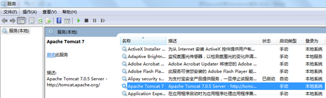

### 删除Windows服务

service.bat uninstall {tomcat服务名}

### 服务启停
#### 命令行方式

以管理员权限打开cmd窗口
服务名称为：tomcat7
启动服务：net start tomcat7
停止服务：net stop tomcat7

#### 在服务管理工具中启动服务

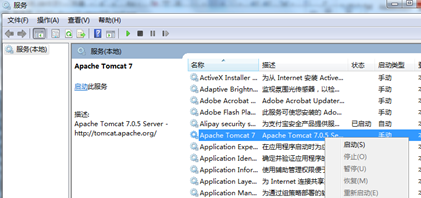
 
#### 设置为开机启动
右击服务，选择属性，把服务启动类型改为自动；

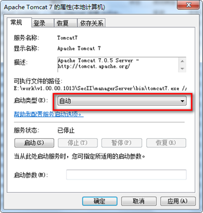

#### 通过tomcat服务配置工具启动

进入tomcat\bin目录,以管理员权限运行tomcat7w.exe

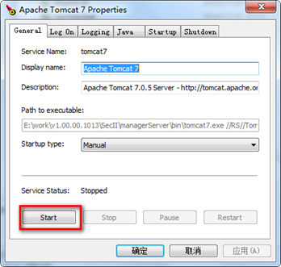

### FAQ
#### 服务注册失败原因
- 如果是win7,有可能是没有以管理员身份运行cmd窗口
- 也有可能是jdk版本和tomcat不配套，尝试更换jdk后再注册；

#### 系统错误109 管道已结束
命令行方式停止报错截图

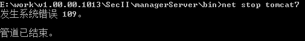

在服务管理工具中停止服务，报错截图

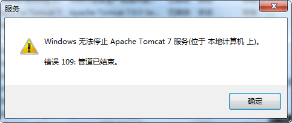

在网上找了好久，资料很少，调整了停止服务的超时时间，也还是不行。最终通过给method配置了一个return方法，竟然不报错了。修改方法如下：

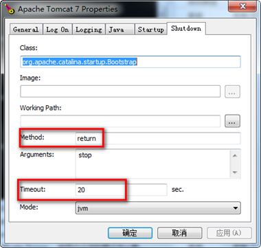

Timeout时间最好设置长一点，20秒以上，不然停止服务还是可能报错。如果设置成0，我猜测应该是没有超时时间，也就是最大超时时间，但是实际使用服务管理工具停止服务时，进度条会一直卡着不动，命令行方式也会等很久，然后报"服务没有响应控制功能"，不知道为什么。
