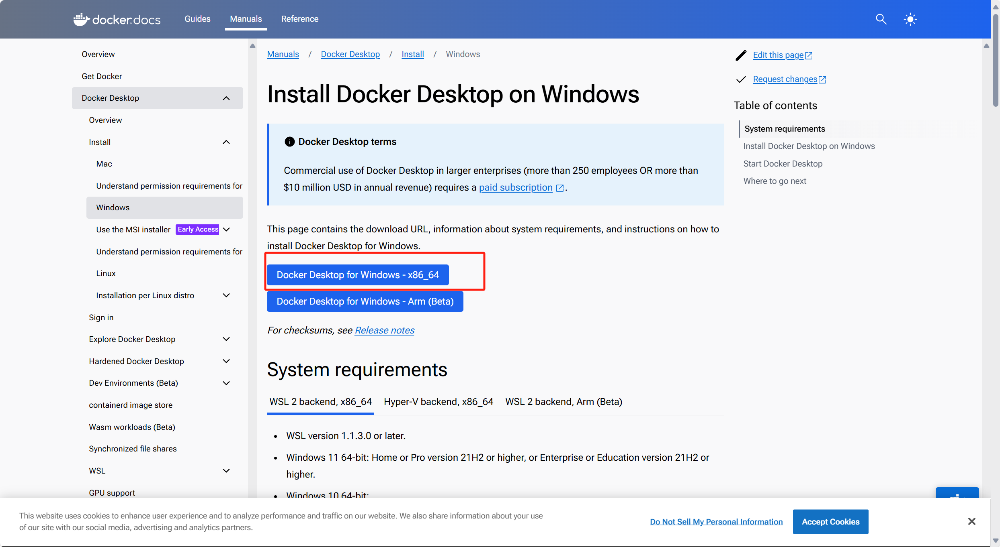
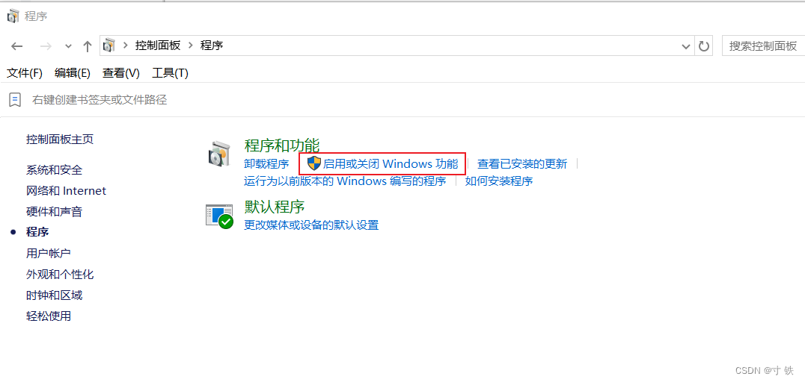
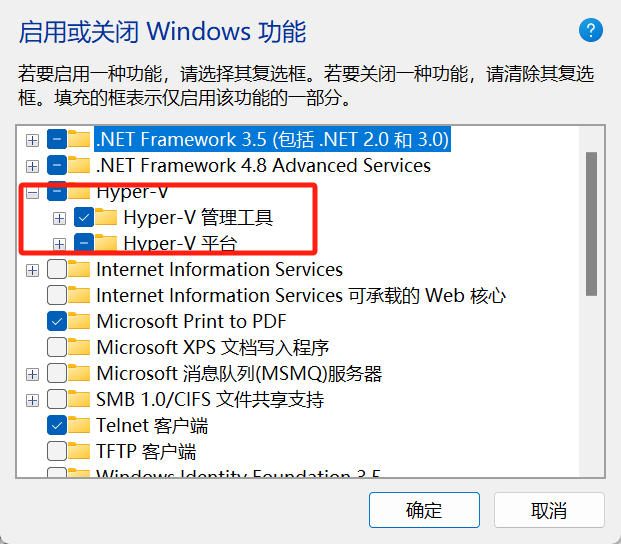
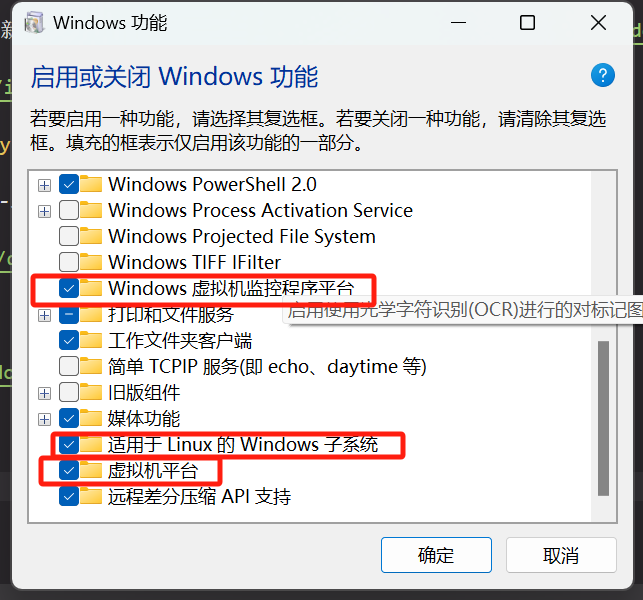
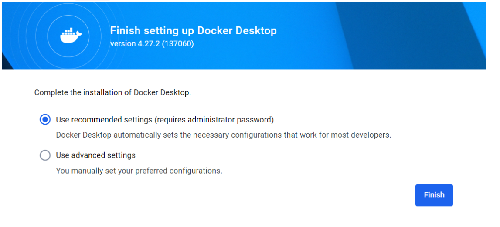
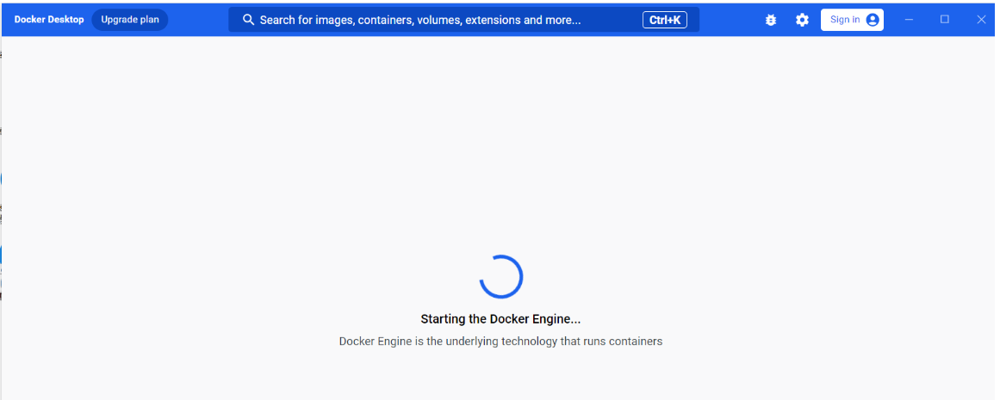
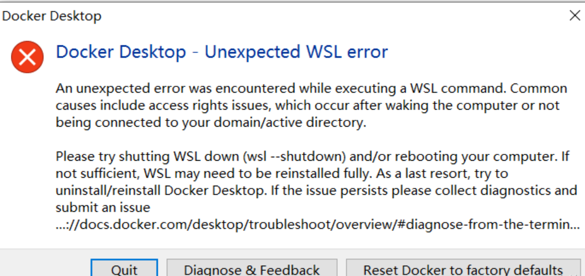

# Docker 安装指南

## 前言

### 什么是 Docker？
Docker 是一个开源平台，支持开发人员构建、部署、运行、更新和管理容器，这些容器是标准化的可执行组件，结合了应用源代码以及在任何环境中运行该代码所需的操作系统 (OS) 库和依赖项。

容器简化了分布式应用的部署和交付过程。 随着组织转向云原生开发和混合多云环境，它们已变得越来越流行。 开发人员可以直接使用 Linux 和其他操作系统中内置的功能，在没有 Docker 的情况下创建容器。 但 Docker 使容器化更加迅速、简便和安全。 截至本文撰写之时，Docker 报告称，已有超过 1300 万名开发人员在使用该平台。

Docker 也指 Docker, Inc.，即销售 Docker 商业版本的企业，还可以是 Docker, Inc. 和许多其他组织和个人开展的 Docker 开源项目。

## 容器的架构

Docker 包括三个基本概念:

- **镜像（Image）**：Docker 镜像（Image），就相当于是一个 root 文件系统。比如官方镜像 ubuntu:16.04 就包含了完整的一套 Ubuntu16.04 最小系统的 root 文件系统。

- **容器（Container）**：镜像（Image）和容器（Container）的关系，就像是面向对象程序设计中的类和实例一样，镜像是静态的定义，容器是镜像运行时的实体。容器可以被创建、启动、停止、删除、暂停等。

- **仓库（Repository）**：仓库可看成一个代码控制中心，用来保存镜像。

## Docker的优势

因此，容器技术可提供虚拟机的所有功能和优势，包括应用隔离、经济高效的可扩展性和可处置性，以及其他重要的优势：

- **更轻巧**：与虚拟机不同，容器不会承载整个操作系统实例和系统管理程序的有效负载。 它们仅包括执行代码所需的操作系统进程和依赖项。 容器大小以兆字节为单位（某些虚拟机则是以千兆字节为单位）来衡量，因此它们可以更好地利用硬件容量，启动速度也更快。

- **提高了开发人员的工作效率**：容器化应用可以"一次编写，随处运行"。 与虚拟机相比，容器的部署、配置和重启过程更迅速且更简单。 这使得容器非常适合在持续集成和持续交付 (CI/CD) 管道中使用，并且更适合采取敏捷和 DevOps 实践的开发团队。

- **提高了资源利用率**：开发人员使用容器在硬件上运行的应用副本数量是使用虚拟机的数倍。 这可以减少云支出。

## 为何使用 Docker？

Docker 如今非常受欢迎，甚至可以与"容器"一词互换使用。 而在 Docker 于 2013 年面世之前，第一批与容器相关的技术早已存在数年，甚至数十年。

最值得注意的是，2008 年，Linux 内核中实现了 LinuXContainers (LXC)，LXC 完全支持单个 Linux 实例的虚拟化。 虽然目前仍在使用 LXC，但也提供了使用 Linux 内核的新技术。 现代的开源 Linux 操作系统 Ubuntu 也提供了此功能。

Docker 支持开发人员使用简单的命令访问这些本机容器化功能，并通过节省工作量的应用程序编程接口 (API) 自动执行。 与 LXC 相比，Docker 提供了以下功能：

- **增强的无缝容器可移植性**：虽然 LXC 容器通常引用特定于机器的配置，但 Docker 容器无需修改即可在任何桌面、数据中心和云环境中运行。

- **更轻巧且更细粒度的更新**：通过使用 LXC，可以在单个容器中组合多个进程。 这样就可以构建持续运行的应用，即使为了更新或修复而关闭某个部分也不例外。

- **自动化容器创建**：Docker 可以基于应用源代码自动构建容器。

- **容器版本控制**：Docker 可以跟踪容器映像的版本，回滚到先前的版本，以及跟踪版本的构建者和构建方式。 它甚至可以只上传现有版本和新版本之间的增量。

- **容器复用**：现有容器可用作基本映像（本质上类似于用于构建新容器的模板）。

- **共享容器库**：开发人员可以访问包含数千个用户贡献容器的开源注册表。

## 安装步骤

:::info
注意以下操作都需在bios里面开启虚拟化才有用
:::

### 一、进入Docker官网

首先先到Docker官网下载最新官方Docker for Windows链接：[Docker下载](https://docs.docker.com/desktop/install/windows-install/)



### 二、启动Microsoft Hyper-V

> 在电脑上打开"控制面板"->"程序"-> "启动或关闭Windows功能"。



- 勾选Hype-V功能



- 并勾选如下内容:



:::danger
在家庭版中，上述操作之后可能还会失败。
失败请执行以下命令

```sh
bcdedit /set hypervisorlaunchtype auto
dism.exe /online /enable-feature /featurename:VirtualMachinePlatform /all /norestart
dism.exe /online /enable-feature /featurename:Microsoft-Hyper-V-All /all /norestart
```

执行完成后重启
:::

### 三、安装wsl

- 使用wsl2命令 `wsl --set-default-version 2`
- 执行命令`wsl --install`

### 四、安装Docker

> 前面步骤直接下一步即可

- 默认勾选，点击Finish即可完成



- 等待启动Docker引擎



- 报错如下：



- 重新更新一下wsl版本，如下命令:

```sh
wsl --update
```

## Docker命令参考

```sh
## 查看版本
docker -v
## 构建镜像,此命令需在Dockerfile所在目录下执行
docker build -t monitor:test-crypt-20240717 ./

docker build -t monitor:dmsa ./
## 导出镜像为monitor-crypt-20240717.tar文件
docker save -o monitor-crypt-20240717.tar monitor:test-crypt-20240717

docker save -o monitor-dmsa-20240808.tar monitor:dmsa
## docker 启动 -v 将系统目录映射到容器里面
docker run -d --name monitor -p 8915:8915 -v /dmas/monitor/application-product.properties:/app/application-product.properties -v /dmas/monitor/mttcert/:/app/secretFilePath/ monitor:test-crypt-20240423
```

## Dockerfile示例

```dockerfile title=Dockerfile
FROM java:openjdk-8u111-alpine
LABEL authors="yinhai"

WORKDIR /app

EXPOSE 8917

COPY ./monitor-boot-test-crypt-20240718.jar /app/monitor-boot-test-crypt-20240718.jar
ENV MONITOR_SECRET_KEY=""

RUN sed -i 's/dl-cdn.alpinelinux.org/mirrors.aliyun.com/g' /etc/apk/repositories
RUN apk add --no-cache tzdata
ENV TZ=Asia/Shanghai

CMD ["java", "-jar","-DmonitorSecretKey=$MONITOR_SECRET_KEY","-Dfile.encoding=utf-8","monitor-boot-test-crypt-20240718.jar"]
```