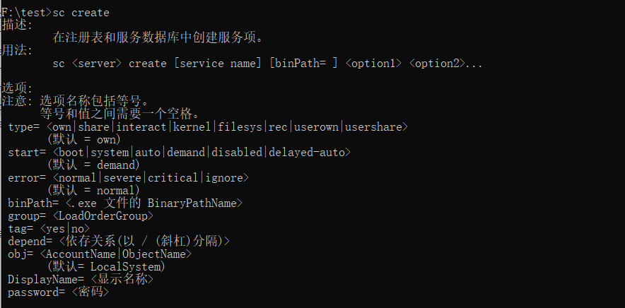
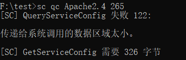
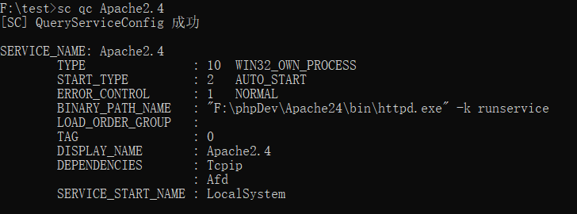
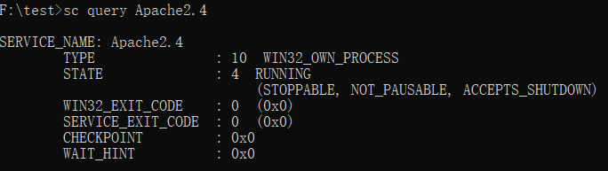

# Windows 常用命令

## 管理员账号管理命令

:::danger

```sh
# 启用管理员用户
net user administrator /active:yes
# 禁用管理员用户
net user administrator /active:no
# 设置管理员密码
net user Administrator *
```
:::

## 临时控制台编码

```bash
chcp 65001
```

## 端口占用

```bash
netstat -aon|findstr "8081"
```

## sc 命令

格式：`SC [Servername] command Servicename [Optionname= Optionvalues]`

### 参数说明

- **Servername** 可选择：可以使用双斜线，如`\\myserver`，也可以是`\\192.168.1.223`来操作远程计算机。如果在本地计算机上操作，就不用添加任何参数。
- **Command**

| 命令 | 说明 | 
| -- | -- | 
| config | 改变一个服务的配置（长久的）|
| continue | 对一个服务送出一个继续控制的要求 |
| control | 对一个服务送出一个控制 |
| create | 创建一个服务（增加到注册表中） |
| delete | 删除一个服务（从注册表中删除） |
| EnumDepend | 列举服务的从属关系 |
| GetDisplayName | 获得一个服务的显示名称 |
| GetKeyName | 获得一个服务的服务键名 |
| interrogate | 对一个服务送出一个询问控制要求 |
| pause | 对一个服务送出一个暂停控制要求 |
| qc | 询问一个服务的配置 |
| query | 询问一个服务的状态，也可以列举服务的状态类型 |
| start | 启动一个服务 |
| stop | 对一个服务送出一个停止的要求 |

示例：



- **Servicename** 在注册表中为 service key 制定的名称。注意这个名称是不同于显示名称的（这个名称可以用 net start 和服务控制面板看到），而 SC 是使用服务键名来鉴别服务的。
- **Optionname** 这个 optionname 和 optionvalues 参数允许你指定操作命令参数的名称和数值。注意，这一点很重要在操作名称和等号之间是没有空格的。一开始我不知道，结果………………，比如，`start= optionvalues`，这个很重要。 
optionvalues 可以是 0，1，或者是更多的操作参数名称和数值对。
如果你想要看每个命令的可以用的 optionvalues，你可以使用 `sc command` 这样的格式。这会为你提供详细的帮助。
- **Optionvalues** 为 optionname 的参数的名称指定它的数值。有效数值范围常常限制于哪一个参数的 optionname。如果要列表请用 `sc command` 来询问每个命令。
- **Comments** 很多的命令需要管理员权限，所以我想说，在你操作这些东西的时候最好是管理员。呵呵！ 

当你键入 SC 而不带任何参数时，SC.exe 会显示帮助信息和可用的命令。当你键入 SC 紧跟着命令名称时，你可以得到一个有关这个命令的详细列表。比如，键入 `sc create` 可以得到和 create 有关的列表。
但是除了一个命令，`sc query`，这会导出该系统中当前正在运行的所有服务和驱动程序的状态。 
当你使用 start 命令时，你可以传递一些参数（arguments）给服务的主函数，但是不是给服务进程的主函数。

### sc create

这个命令可以在注册表和服务控制管理数据库建立一个入口。

语法：`sc [servername] create Servicename [Optionname= Optionvalues]`

| Optionname | Optionvalues  | 说明 |
| -- | -- | -- |
| type | own, share, interact, kernel, filesys | 建立服务的类型，选项值包括驱动程序使用的类型，默认是 share |
| start | boot, system, auto, demand, disabled  | 启动服务的类型，选项值包括驱动程序使用的类型，默认是 demand（手动） |
| error | normal, severe, critical, ignore | 服务在导入失败错误的严重性，默认是 normal |
| binPath | 具体的服务二进制文件路径 | 服务二进制文件的路径名，这里没有默认值，这个字符串是必须设置的 |
| group |  | 这个服务属于的组，这个组的列表保存在注册表中的 ServiceGroupOrder 下。默认是 nothing |
| tag |  | 如果这个字符串被设置为 yes，sc 可以从 CreateService call 中得到一个 tagId。然而，SC 并不显示这个标签，所以使用这个没有多少意义。默认是 nothing |
| depend | 有空格的字符串 | 在这个服务启动前必须启动的服务的名称或者是组 |
| obj |  | 账号运行使用的名称，也可以说是登陆身份。默认是 localsystem |
| Displayname |  | 一个为在用户界面程序中鉴别各个服务使用的字符串 |
| password |  | 一个密码，如果一个不同于 localsystem 的账号使用时需要使用这个 |

> 示例

常用格式：`sc create ServiceName binPath= 路径 start= auto`

:::tip

注意：等号后面的空格必须

:::

**例一：**

1. 将 Tomcat 加入到系统服务中:
   ```
   sc create Tomcat binPath= F:/apache-tomcat/bin/startup.bat start= auto
   ```

2. 将 Tomcat 服务删除:
   ```
   sc delete Tomcat
   ```

**例二：**
```
sc create MyService binPath= "cmd.exe /c start c:\a.exe" start= auto displayname= "AutoStartOracle Services"
```

### sc qc

这个 `sc qc` "询问配置" 命令可以列出一个服务的配置信息和 QUERY_SERVICE_CONFIG 结构。

语法：`sc [Servername] qc Servicename [Buffersize]`

- **Servername**
- **Servicename**
  请参考上文
- **Buffersize** 传递给系统调用的数据区域太小

:::tip

Buffersize 默认：326 字节。太小会提示如下：

:::



> 示例



### sc query

`sc query` 命令可以获得服务的信息。

语法：`sc [Servername] query { Servicename | Optionname = Optionvalues... }`

- **Servername**
- **Servicename**
  请参考上文

| Optionname | Optionvalues  | 说明 |
| -- | -- | -- |
| type | driver, service, all | 列举服务的类型，默认是 service |
| state | active, inactive, all | 列举服务的状态，默认是 active |
| bufsize |  | 列举缓冲区的尺寸，默认是 1024 bytes |
| ri |  | 恢复指针的数字，默认是 0  |

在启动计算机后，使用 `sc query` 命令会告诉你是否，或者不是一个启动服务的尝试。如果这个服务成功启动，WIN32_EXIT_CODE 区间会将会包含一个 0，当尝试不成功时，当它意识到这个服务不能够启动时，这个区间也会提供一个退出码给服务。

> 示例



### sc 命令启动禁用的服务

例如：启动 telnet 服务
```sh
sc config tlntsvr start= auto
net start tlntsvr
```
