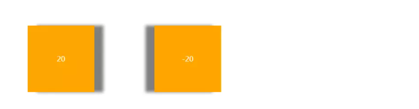
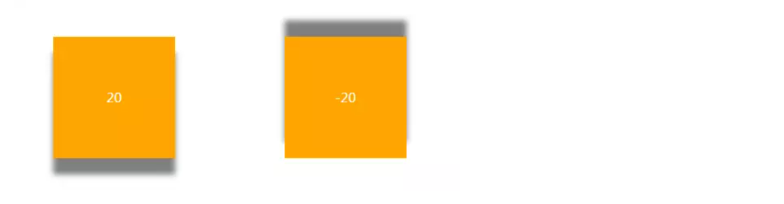
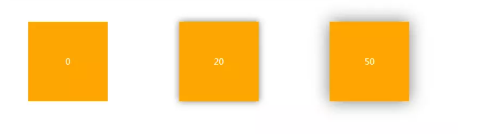
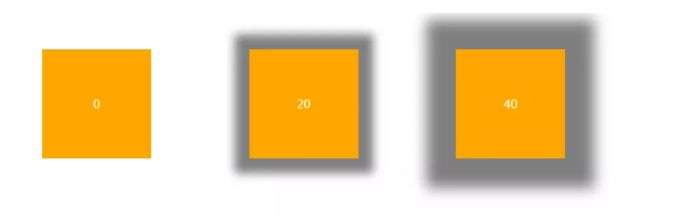
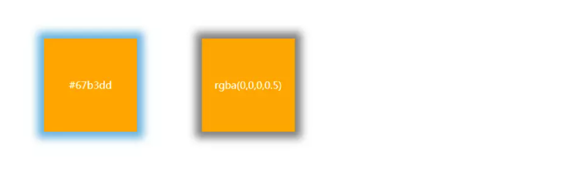
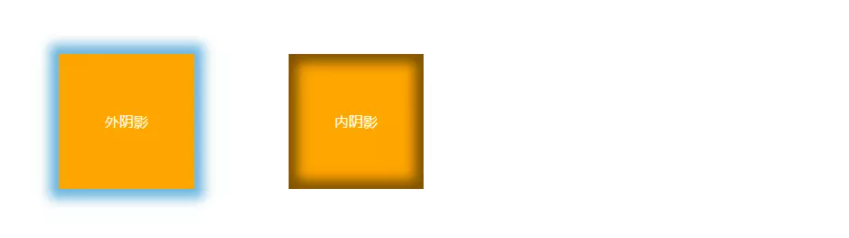

# box-shadow详解
## box-shadow属性语法

box-shadow 属性用于向元素添加一个或多个阴影。属性接受值最多由六个不同的部分组成，正式语法如下：

```css
box-shadow: [inset?] [&lt;offset-x&gt; &lt;offset-y&gt;] [&lt;blur-radius&gt;?] [&lt;spread-radius&gt;?] [&lt;color&gt;?]
```

:::tip
box-shadow 不像其它的属性，比如 border，它们的接受值可以被拆分为一系列子属性，box-shadow 属性没有子属性。这意味着记住这些组成部分的顺序更加重要，尤其是那些长度值。
:::

参数说明（按顺序）：
- **inset** - 可选，投影方式，内阴影
- **offset-x** - X轴偏移量，必需
- **offset-y** - Y轴偏移量，必需
- **blur-radius** - 可选，阴影模糊半径
- **spread-radius** - 可选，阴影扩展半径
- **color** - 可选，阴影颜色

## 使用示例

### offset-x

第一个长度值指明了阴影水平方向的偏移，即阴影在 x 轴的位置。值为正数时，阴影在元素的右侧；值为负数时，阴影在元素的左侧。

```css
.left { box-shadow: 20px 0px 10px 0px rgba(0,0,0,0.5) }
.right { box-shadow: -20px 0px 10px 0px rgba(0,0,0,0.5) }
```



### offset-y

第二个长度值指明了阴影竖直方向的偏移，即阴影在 y 轴的位置。值为正数时，阴影在元素的下方；值为负数时，阴影在元素的上方。

```css
.left { box-shadow: 0px 20px 10px 0px rgba(0,0,0,0.5) }
.right { box-shadow: 0px -20px 10px 0px rgba(0,0,0,0.5) }
```



### blur
第三个长度值代表了阴影的模糊半径，举例来说，就是你在设计软件中使用 高斯模糊 滤波器带来的效果。值为 0 意味着该阴影是固态而锋利的，完全完全没有模糊效果。blur 值越大，阴影则更不锋利而更朦胧 / 模糊。负值是不合法的，会被修正成 0。

```css
.left { box-shadow: 0px 0px 0px 0px rgba(0,0,0,0.5) }
.middle { box-shadow: 0px 0px 20px 0px rgba(0,0,0,0.5) }
.right { box-shadow: 0px 0px 50px 0px rgba(0,0,0,0.5) }
```



### spread

第四个长度代表了阴影扩展半径，其值可以是正负值，如果值为正，则整个阴影都延展扩大，反之值为负值是，则缩小。前提是存在阴影模糊半径。

```css
.left { box-shadow: 0px 0px 0px 0px rgba(0,0,0,0.5) }
.middle { box-shadow: 0px 0px 20px 20px rgba(0,0,0,0.5) }
.right { box-shadow: 0px 0px 50px 50px rgba(0,0,0,0.5) }
```



### color

color 部分的值正如你所预料的，是指阴影的颜色。它可以是任意的颜色单元 （见 在 CSS 中与颜色打交道）。

```css
.left { box-shadow: 0px 0px 20px 10px #67b3dd }
.right { box-shadow: 0px 0px 20px 10px rgba(0,0,0,0.5) }
```



### position

此参数是一个可选值，如果不设值，其默认的投影方式是外阴影；
如果取其唯一值"inset",就是将外阴影变成内阴影，也就是说设置阴影类型为"inset"时，其投影就是内阴影。

```css
.left { box-shadow: 0px 0px 20px 10px #67b3dd }
.right { box-shadow: 0px 0px 20px 10px rgba(0,0,0,0.5) inset}
```



## 高级用法

### 多层阴影
box-shadow 支持设置多层阴影，用逗号分隔：

```css
/* 外阴影 + 内阴影 */
.multi-shadow {
  box-shadow: 
    3px 3px 5px 6px rgba(0,0,0,0.3),  /* 外阴影 */
    inset 0 0 10px rgba(0,0,255,0.5); /* 内阴影 */
}

/* 多层外阴影模拟立体感 */
.elevation {
  box-shadow:
    0 1px 1px rgba(0,0,0,0.12),
    0 2px 2px rgba(0,0,0,0.12),
    0 4px 4px rgba(0,0,0,0.12),
    0 8px 8px rgba(0,0,0,0.12);
}
```

### 特殊效果

```css
/* 只有模糊，没有偏移 */
.glow {
  box-shadow: 0 0 20px rgba(255,0,0,0.5);
}

/* 只有单边阴影 */
.bottom-only {
  box-shadow: 0 5px 5px -5px rgba(0,0,0,0.5);
}

/* 霓虹效果 */
.neon {
  box-shadow:
    0 0 5px #fff,
    0 0 10px #fff,
    0 0 20px #ff00de,
    0 0 30px #ff00de;
}
```

## 浏览器兼容性

box-shadow 获得了广泛的浏览器支持：
- Chrome 10+
- Firefox 4+
- Safari 5.1+
- Edge 12+
- IE 9+ (仅支持外阴影)

对于旧版浏览器，可以使用以下前缀：
```css
.shadow {
  -webkit-box-shadow: 10px 10px 5px 0px rgba(0,0,0,0.75);
  -moz-box-shadow: 10px 10px 5px 0px rgba(0,0,0,0.75);
  box-shadow: 10px 10px 5px 0px rgba(0,0,0,0.75);
}
```

## 性能注意事项

1. **大模糊半径**会影响渲染性能，尽量避免在动画中使用
2. **多层阴影**也会增加渲染负担
3. 在滚动容器中大量使用 box-shadow 可能导致滚动卡顿
4. 可以使用 `will-change: box-shadow` 优化动画性能

## 常见问题

**Q: 为什么我的阴影没有显示？**
- 确保 blur 或 spread 值不是 0（除非你想要一个"硬"阴影）
- 检查颜色的 alpha 值是否为 0
- 确认元素不是 `overflow: hidden` 裁剪了阴影

**Q: 如何创建透明元素的阴影？**
使用 `drop-shadow()` 滤镜：
```css
.transparent-shadow {
  filter: drop-shadow(10px 10px 10px rgba(0,0,0,0.5));
}
```

## 实用工具和参考

- [MDN box-shadow 文档](https://developer.mozilla.org/zh-CN/docs/Web/CSS/box-shadow)
- [CSS-Tricks box-shadow 指南](https://css-tricks.com/almanac/properties/b/box-shadow/)
- [Box Shadow CSS Generator](https://www.cssmatic.com/box-shadow) - 在线阴影生成工具

