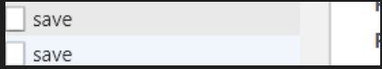

# HTTP 预检请求

## 背景

近期在项目中发现浏览器发出的接口请求有时候会调用两次，第一次返回报跨域且鉴权未通过，第二次请求也失败。查了一下资料，原来是由于预检测请求。

不知道大家有没有发现，有时候我们在调用后台接口的时候，会请求两次，如下图：

其实第一次发送的就是 preflight request（预检请求），那么这篇文章将讲一下，为什么要发预检请求，什么时候会发预检请求，预检请求都做了什么。

## 一、为什么要发预检请求

我们都知道浏览器的同源策略，就是出于安全考虑，浏览器会限制从脚本发起的跨域 HTTP 请求，像 XMLHttpRequest 和 Fetch 都遵循同源策略。

浏览器限制跨域请求一般有两种方式：

1. 浏览器限制发起跨域请求
2. 跨域请求可以正常发起，但是返回的结果被浏览器拦截了

一般浏览器都是第二种方式限制跨域请求，那就是说请求已到达服务器，并有可能对数据库里的数据进行了操作，但是返回的结果被浏览器拦截了，那么我们就获取不到返回结果，这是一次失败的请求，但是可能对数据库里的数据产生了影响。

为了防止这种情况的发生，规范要求，对这种可能对服务器数据产生副作用的 HTTP 请求方法，浏览器必须先使用 OPTIONS 方法发起一个预检请求，从而获知服务器是否允许该跨域请求：如果允许，就发送带数据的真实请求；如果不允许，则阻止发送带数据的真实请求。

## 二、什么时候发预检请求

HTTP 请求包括：**简单请求** 和 **需预检的请求**

### 1. 简单请求

简单请求不会触发 CORS 预检请求，"简单请求"术语并不属于 Fetch（其中定义了 CORS）规范。

若满足所有下述条件，则该请求可视为"简单请求"：

> 使用下列方法之一：

- GET
- HEAD
- POST
- Content-Type:（仅当 POST 方法的 Content-Type 值等于下列之一才算做简单需求）
  - text/plain
  - multipart/form-data
  - application/x-www-form-urlencoded

### 2. 需预检的请求

"需预检的请求"要求必须首先使用 OPTIONS 方法发起一个预检请求到服务区，以获知服务器是否允许该实际请求。"预检请求"的使用，可以避免跨域请求对服务器的用户数据产生未预期的影响。

当请求满足下述任一条件时，即应首先发送预检请求：

> 使用了下面任一 HTTP 方法：

- PUT
- DELETE
- CONNECT
- OPTIONS
- TRACE
- PATCH
- 人为设置了对 CORS 安全的首部字段集合之外的其他首部字段。该集合为：
  - Accept
  - Accept-Language
  - Content-Language
  - Content-Type
  - DPR
  - Downlink
  - Save-Data
  - Viewport-Width
  - Width
- Content-Type 的值不属于下列之一:
  - application/x-www-form-urlencoded
  - multipart/form-data
  - text/plain
